# 70. Automated Test Case Generation for CAN Bus

Automated Test Case Generation (ATCG) for CAN systems applies formal testing methodologies to ensure exhaustive coverage of CAN protocol behaviour, message timing, signal ranges, and error conditions — without the impracticality of writing thousands of test cases manually. Two dominant strategies are **model-based testing (MBT)**, which derives tests from a formal specification of the system under test, and **property-based testing (PBT)**, which defines *invariants* that must hold and lets an engine generate and shrink counterexamples automatically.

Let me start with the overall architecture of a CAN automated test suite generator:

<br>

---

## 1. Core Concepts

### Model-Based Testing (MBT) for CAN

MBT derives test cases from a formal specification of the system. For CAN, the model is typically:

- **DBC / ARXML files** — define every message ID, signal name, bit position, scaling, range, and cycle time
- **State machines** — capture valid node state transitions (e.g., `NM_INIT → NM_NORMAL → NM_SLEEP`)
- **Coverage criteria** — all-states, all-transitions, boundary values, combinatorial signal interaction

The generator traverses the model, applies a coverage criterion, and emits concrete CAN frames and sequences as test cases.

### Property-Based Testing (PBT) for CAN

PBT flips the paradigm: instead of specifying inputs, you specify *invariants* that must always hold. A PBT engine then generates thousands of random CAN frames or sequences and checks each one. When a violation is found, the framework *shrinks* the failing input to the smallest counterexample that still triggers the failure. Classic invariants for CAN:

- Signal values always decode within their physical min/max
- DLC matches the declared message length
- No two messages with the same ID carry different signals (consistency)
- Cycle time jitter stays within ±10% of the nominal period
- The node responds to a diagnostic request within 50 ms

---

## 2. C/C++ Implementation

### 2a. DBC Model Parser and MBT Generator

```cpp
// can_mbt_generator.hpp
#pragma once
#include <cstdint>
#include <string>
#include <vector>
#include <unordered_map>
#include <functional>
#include <optional>
#include <random>
#include <cassert>

// ── Signal descriptor (from DBC) ─────────────────────────────────────────────
struct CANSignal {
    std::string name;
    uint8_t     start_bit;
    uint8_t     length;        // bits
    bool        is_signed;
    double      factor;
    double      offset;
    double      min_physical;
    double      max_physical;
    std::string unit;
};

// ── Message descriptor ────────────────────────────────────────────────────────
struct CANMessage {
    uint32_t              id;       // 11-bit or 29-bit (bit 31 set for extended)
    std::string           name;
    uint8_t               dlc;      // 0-8 bytes
    uint32_t              cycle_ms; // 0 = event-driven
    std::vector<CANSignal> signals;
};

// ── A single generated test frame ────────────────────────────────────────────
struct TestFrame {
    uint32_t             msg_id;
    uint8_t              dlc;
    std::array<uint8_t,8> data{};
    std::string          label;      // human-readable intent
    bool                 expect_ack; // true for nominal, false for bus-off tests
};

// ── Test sequence (ordered frames + timing) ──────────────────────────────────
struct TestSequence {
    std::string              name;
    std::vector<TestFrame>   frames;
    std::vector<uint32_t>    inter_frame_gap_us; // gap before each frame
};

// ── Coverage criterion ────────────────────────────────────────────────────────
enum class Coverage {
    BoundaryValue,          // min, min+1 LSB, nominal, max-1 LSB, max
    AllStates,              // every state machine state
    AllTransitions,         // every edge in the state machine
    RandomFuzz,             // random values within range
    PairwiseCombinatorial,  // 2-way interaction of all signals
};

// ── MBT generator ────────────────────────────────────────────────────────────
class CANMBTGenerator {
public:
    explicit CANMBTGenerator(std::vector<CANMessage> model, uint64_t seed = 42)
        : model_(std::move(model)), rng_(seed) {}

    // Encode a physical signal value into raw bytes
    void encode_signal(std::array<uint8_t,8>& data,
                       const CANSignal& sig,
                       double physical_value) const
    {
        // Reverse scaling: raw = (physical - offset) / factor
        int64_t raw = static_cast<int64_t>(
            (physical_value - sig.offset) / sig.factor);

        // Clamp to bit-width
        int64_t max_raw = (1LL << sig.length) - 1;
        if (sig.is_signed) {
            int64_t half = 1LL << (sig.length - 1);
            raw = std::max(-half, std::min(half - 1, raw));
        } else {
            raw = std::max(0LL, std::min(max_raw, raw));
        }

        // Pack into data array (Intel byte order assumed for simplicity)
        for (uint8_t bit = 0; bit < sig.length; ++bit) {
            uint8_t byte_idx = (sig.start_bit + bit) / 8;
            uint8_t bit_pos  = (sig.start_bit + bit) % 8;
            if (raw & (1LL << bit))
                data[byte_idx] |= (1u << bit_pos);
            else
                data[byte_idx] &= ~(1u << bit_pos);
        }
    }

    // ── Boundary value analysis per signal ───────────────────────────────────
    std::vector<TestFrame> generate_boundary_frames(const CANMessage& msg)
    {
        std::vector<TestFrame> out;

        // Nominal: all signals at mid-range
        TestFrame nominal;
        nominal.msg_id    = msg.id;
        nominal.dlc       = msg.dlc;
        nominal.label     = msg.name + "_nominal";
        nominal.expect_ack = true;
        for (auto& s : msg.signals) {
            double mid = (s.min_physical + s.max_physical) / 2.0;
            encode_signal(nominal.data, s, mid);
        }
        out.push_back(nominal);

        // Per-signal boundary sweeps
        for (auto& sig : msg.signals) {
            auto make_frame = [&](double val, const std::string& tag) {
                TestFrame f;
                f.msg_id     = msg.id;
                f.dlc        = msg.dlc;
                f.label      = msg.name + "_" + sig.name + "_" + tag;
                f.expect_ack = true;
                // Set all signals to nominal first, then override
                for (auto& s : msg.signals) {
                    double mid = (s.min_physical + s.max_physical) / 2.0;
                    encode_signal(f.data, s, mid);
                }
                encode_signal(f.data, sig, val);
                return f;
            };

            double step = sig.factor; // 1 raw LSB = factor physical units
            out.push_back(make_frame(sig.min_physical,          "min"));
            out.push_back(make_frame(sig.min_physical + step,   "min_plus_lsb"));
            out.push_back(make_frame(sig.max_physical - step,   "max_minus_lsb"));
            out.push_back(make_frame(sig.max_physical,          "max"));
        }
        return out;
    }

    // ── Out-of-range / invalid frames (negative testing) ─────────────────────
    std::vector<TestFrame> generate_invalid_frames(const CANMessage& msg)
    {
        std::vector<TestFrame> out;

        // Wrong DLC
        for (uint8_t dlc : {0u, 1u, 7u}) {
            if (dlc == msg.dlc) continue;
            TestFrame f;
            f.msg_id     = msg.id;
            f.dlc        = dlc;
            f.label      = msg.name + "_wrong_dlc_" + std::to_string(dlc);
            f.expect_ack = false;
            out.push_back(f);
        }

        // All-ones payload (raw bit pattern stress)
        TestFrame all_ones;
        all_ones.msg_id     = msg.id;
        all_ones.dlc        = msg.dlc;
        all_ones.data.fill(0xFF);
        all_ones.label      = msg.name + "_payload_all_ones";
        all_ones.expect_ack = true; // node must accept even garbled signals
        out.push_back(all_ones);

        // All-zeros payload
        TestFrame all_zeros;
        all_zeros.msg_id     = msg.id;
        all_zeros.dlc        = msg.dlc;
        all_zeros.label      = msg.name + "_payload_all_zeros";
        all_zeros.expect_ack = true;
        out.push_back(all_zeros);

        return out;
    }

    // ── Random fuzz generator ─────────────────────────────────────────────────
    std::vector<TestFrame> generate_fuzz_frames(const CANMessage& msg,
                                                size_t count = 200)
    {
        std::vector<TestFrame> out;
        out.reserve(count);
        std::uniform_int_distribution<uint8_t> byte_dist(0, 255);

        for (size_t i = 0; i < count; ++i) {
            TestFrame f;
            f.msg_id     = msg.id;
            f.dlc        = msg.dlc;
            f.label      = msg.name + "_fuzz_" + std::to_string(i);
            f.expect_ack = true;
            for (uint8_t b = 0; b < msg.dlc; ++b)
                f.data[b] = byte_dist(rng_);
            out.push_back(f);
        }
        return out;
    }

    // ── Timing / cycle sequence generator ────────────────────────────────────
    TestSequence generate_cycle_sequence(const CANMessage& msg,
                                         size_t cycles = 10)
    {
        assert(msg.cycle_ms > 0 && "Message must be cyclic");
        TestSequence seq;
        seq.name = msg.name + "_cycle_test";

        auto frames = generate_boundary_frames(msg);
        uint32_t gap_us = msg.cycle_ms * 1000u;

        for (size_t c = 0; c < cycles; ++c) {
            for (auto& f : frames) {
                seq.frames.push_back(f);
                seq.inter_frame_gap_us.push_back(gap_us);
            }
        }
        return seq;
    }

    // ── Full suite generation ─────────────────────────────────────────────────
    std::vector<TestSequence> generate_suite(Coverage cov)
    {
        std::vector<TestSequence> suite;
        for (auto& msg : model_) {
            TestSequence seq;
            seq.name = msg.name;

            std::vector<TestFrame> frames;
            if (cov == Coverage::BoundaryValue || cov == Coverage::AllStates) {
                auto bv = generate_boundary_frames(msg);
                frames.insert(frames.end(), bv.begin(), bv.end());
                auto inv = generate_invalid_frames(msg);
                frames.insert(frames.end(), inv.begin(), inv.end());
            }
            if (cov == Coverage::RandomFuzz) {
                frames = generate_fuzz_frames(msg, 500);
            }

            seq.frames = std::move(frames);
            seq.inter_frame_gap_us.assign(seq.frames.size(), 0u);
            suite.push_back(std::move(seq));
        }
        return suite;
    }

private:
    std::vector<CANMessage> model_;
    std::mt19937_64         rng_;
};
```

### 2b. Property-Based Testing Engine

```cpp
// can_property_tester.hpp
#pragma once
#include "can_mbt_generator.hpp"
#include <functional>
#include <iostream>
#include <sstream>
#include <stdexcept>

// ── Decoded signal result ─────────────────────────────────────────────────────
struct DecodedSignal {
    std::string name;
    double      physical_value;
    bool        in_range;
};

// ── Property: a named predicate over a frame ─────────────────────────────────
struct CANProperty {
    std::string                          name;
    std::function<bool(const TestFrame&)> predicate;
    std::string                          description;
};

// ── Counterexample record ─────────────────────────────────────────────────────
struct Counterexample {
    TestFrame   frame;
    std::string property_name;
    std::string detail;
};

// ── Decode a signal from raw CAN data ────────────────────────────────────────
inline double decode_signal(const std::array<uint8_t,8>& data,
                            const CANSignal& sig)
{
    int64_t raw = 0;
    for (uint8_t bit = 0; bit < sig.length; ++bit) {
        uint8_t byte_idx = (sig.start_bit + bit) / 8;
        uint8_t bit_pos  = (sig.start_bit + bit) % 8;
        if (data[byte_idx] & (1u << bit_pos))
            raw |= (1LL << bit);
    }
    // Sign-extend if signed
    if (sig.is_signed && (raw & (1LL << (sig.length - 1))))
        raw |= ~((1LL << sig.length) - 1);

    return static_cast<double>(raw) * sig.factor + sig.offset;
}

// ── Property-based test runner ────────────────────────────────────────────────
class CANPropertyTester {
public:
    CANPropertyTester(const CANMessage& msg, uint64_t seed = 42)
        : msg_(msg), rng_(seed) {}

    // Register a named property
    void add_property(CANProperty prop) {
        properties_.push_back(std::move(prop));
    }

    // Register standard DBC-derived properties automatically
    void add_standard_properties()
    {
        // P1: DLC correctness
        add_property({
            "dlc_correct",
            [this](const TestFrame& f) { return f.dlc == msg_.dlc; },
            "Frame DLC must match message descriptor"
        });

        // P2: All signals decode within physical range
        for (auto& sig : msg_.signals) {
            add_property({
                "signal_range_" + sig.name,
                [&sig](const TestFrame& f) {
                    double val = decode_signal(f.data, sig);
                    return val >= sig.min_physical && val <= sig.max_physical;
                },
                sig.name + " must be in [" +
                    std::to_string(sig.min_physical) + ", " +
                    std::to_string(sig.max_physical) + "]"
            });
        }

        // P3: No reserved bits set (bit 7 of byte 0 as example)
        add_property({
            "no_reserved_bits",
            [](const TestFrame& f) {
                // Example: byte 0 bit 7 is reserved in this message
                return !(f.data[0] & 0x80);
            },
            "Reserved bits must not be set"
        });
    }

    // Shrink a failing frame: try zeroing bytes one at a time
    TestFrame shrink(const TestFrame& failing, const CANProperty& prop) const
    {
        TestFrame best = failing;
        bool improved  = true;

        while (improved) {
            improved = false;
            for (uint8_t b = 0; b < best.dlc; ++b) {
                if (best.data[b] == 0) continue;
                TestFrame candidate = best;
                candidate.data[b] = 0;
                if (!prop.predicate(candidate)) {
                    best     = candidate;
                    improved = true;
                }
            }
            // Also try clearing individual bits
            for (uint8_t b = 0; b < best.dlc; ++b) {
                for (uint8_t bit = 0; bit < 8; ++bit) {
                    if (!(best.data[b] & (1u << bit))) continue;
                    TestFrame candidate = best;
                    candidate.data[b] &= ~(1u << bit);
                    if (!prop.predicate(candidate)) {
                        best     = candidate;
                        improved = true;
                    }
                }
            }
        }
        return best;
    }

    // Run all properties against N random frames
    std::vector<Counterexample> run(size_t iterations = 10000)
    {
        std::vector<Counterexample> failures;
        std::uniform_int_distribution<uint8_t> byte_dist(0, 255);

        for (size_t i = 0; i < iterations; ++i) {
            // Generate random frame
            TestFrame f;
            f.msg_id = msg_.id;
            f.dlc    = msg_.dlc;
            f.label  = "fuzz_" + std::to_string(i);
            f.expect_ack = true;
            for (uint8_t b = 0; b < f.dlc; ++b)
                f.data[b] = byte_dist(rng_);

            // Check every property
            for (auto& prop : properties_) {
                if (!prop.predicate(f)) {
                    TestFrame minimal = shrink(f, prop);
                    std::ostringstream detail;
                    detail << "Failed at iteration " << i << ". Shrunk payload: [";
                    for (uint8_t b = 0; b < minimal.dlc; ++b)
                        detail << std::hex << (int)minimal.data[b] << " ";
                    detail << "]";

                    failures.push_back({minimal, prop.name, detail.str()});
                    break; // one failure per frame is enough
                }
            }
        }
        return failures;
    }

    // Print a human-readable report
    static void print_report(const std::vector<Counterexample>& failures)
    {
        if (failures.empty()) {
            std::cout << "[PASS] No property violations found.\n";
            return;
        }
        std::cout << "[FAIL] " << failures.size() << " violation(s):\n";
        for (auto& ce : failures) {
            std::cout << "  Property : " << ce.property_name << "\n"
                      << "  Detail   : " << ce.detail        << "\n\n";
        }
    }

private:
    CANMessage               msg_;
    std::vector<CANProperty> properties_;
    std::mt19937_64          rng_;
};
```

### 2c. State Machine MBT — All-Transitions Coverage

```cpp
// can_statemachine_mbt.hpp
#pragma once
#include "can_mbt_generator.hpp"
#include <map>
#include <set>
#include <queue>
#include <algorithm>

// ── State machine model for a CAN node ───────────────────────────────────────
struct State  { std::string name; };
struct Event  { std::string name; uint32_t trigger_msg_id; };

struct Transition {
    std::string from_state;
    std::string to_state;
    Event       event;
    std::optional<TestFrame> stimulus; // frame that triggers the transition
};

class CANStateMachineMBT {
public:
    void add_state(State s)       { states_.push_back(s); }
    void add_transition(Transition t) { transitions_.push_back(t); }
    void set_initial(std::string s)  { initial_ = std::move(s); }

    // Generate minimal set of test sequences covering all transitions (Chinese Postman)
    std::vector<TestSequence> all_transitions_coverage() const
    {
        std::vector<TestSequence> suites;

        // BFS from initial state to find a path to each transition's source
        for (auto& t : transitions_) {
            TestSequence seq;
            seq.name = "transition_" + t.from_state + "_to_" + t.to_state
                       + "_via_" + t.event.name;

            // Find path from initial to t.from_state
            auto path = bfs_path(initial_, t.from_state);

            for (auto& step : path) {
                if (step.stimulus) {
                    seq.frames.push_back(*step.stimulus);
                    seq.inter_frame_gap_us.push_back(1000); // 1 ms
                }
            }

            // Apply the transition itself
            if (t.stimulus) {
                seq.frames.push_back(*t.stimulus);
                seq.inter_frame_gap_us.push_back(1000);
            }

            suites.push_back(seq);
        }
        return suites;
    }

private:
    // BFS returning the sequence of transitions from start to goal state
    std::vector<Transition> bfs_path(const std::string& start,
                                      const std::string& goal) const
    {
        if (start == goal) return {};

        std::map<std::string, std::string>     parent_state;
        std::map<std::string, const Transition*> parent_edge;
        std::queue<std::string>                 queue;

        queue.push(start);
        parent_state[start] = "";

        while (!queue.empty()) {
            auto curr = queue.front(); queue.pop();
            for (auto& t : transitions_) {
                if (t.from_state != curr) continue;
                if (parent_state.count(t.to_state)) continue;
                parent_state[t.to_state] = curr;
                parent_edge[t.to_state]  = &t;
                if (t.to_state == goal) goto found;
                queue.push(t.to_state);
            }
        }
        return {}; // no path
        found:
        // Reconstruct path
        std::vector<Transition> path;
        for (std::string cur = goal; cur != start; cur = parent_state[cur])
            path.push_back(*parent_edge[cur]);
        std::reverse(path.begin(), path.end());
        return path;
    }

    std::vector<State>      states_;
    std::vector<Transition> transitions_;
    std::string             initial_;
};
```

### 2d. Usage Example

```cpp
// main.cpp
#include "can_mbt_generator.hpp"
#include "can_property_tester.hpp"
#include "can_statemachine_mbt.hpp"
#include <iostream>

int main()
{
    // ── Define a simple powertrain message from a DBC ─────────────────────────
    CANMessage engine_speed_msg{
        .id       = 0x0C4,
        .name     = "EngineSpeed",
        .dlc      = 8,
        .cycle_ms = 10,
        .signals  = {
            { "RPM",     0,  16, false, 0.25, 0.0,   0.0, 16383.75, "rpm" },
            { "Load",   16,   8, false, 0.4,  0.0,   0.0,   100.0,  "%" },
            { "TorqReq",24,   8,  true, 1.0,  -125.0,-125.0, 125.0, "Nm" },
        }
    };

    // ── 1. MBT: boundary value coverage ──────────────────────────────────────
    CANMBTGenerator gen({engine_speed_msg}, /*seed=*/0xDEADBEEF);
    auto suite = gen.generate_suite(Coverage::BoundaryValue);
    std::cout << "Generated " << suite.size() << " test sequences\n";
    for (auto& seq : suite)
        std::cout << "  Sequence '" << seq.name << "' — "
                  << seq.frames.size() << " frames\n";

    // ── 2. PBT: property checking ─────────────────────────────────────────────
    CANPropertyTester pbt(engine_speed_msg, /*seed=*/42);
    pbt.add_standard_properties();

    // Custom: TorqReq + Load correlation — if TorqReq > 50 Nm, Load must be > 10%
    pbt.add_property({
        "torque_load_correlation",
        [&engine_speed_msg](const TestFrame& f) {
            double torq = decode_signal(f.data, engine_speed_msg.signals[2]);
            double load = decode_signal(f.data, engine_speed_msg.signals[1]);
            if (torq > 50.0) return load > 10.0;
            return true;
        },
        "High torque requires non-trivial engine load"
    });

    auto failures = pbt.run(50000);
    CANPropertyTester::print_report(failures);

    // ── 3. State machine coverage ─────────────────────────────────────────────
    CANStateMachineMBT sm;
    sm.add_state({"NM_INIT"});
    sm.add_state({"NM_NORMAL"});
    sm.add_state({"NM_SLEEP_PREPARE"});
    sm.add_state({"NM_SLEEP"});
    sm.set_initial("NM_INIT");

    // Transition: NM_INIT → NM_NORMAL on first EngineSpeed frame
    TestFrame startup_frame;
    startup_frame.msg_id = 0x0C4;
    startup_frame.dlc    = 8;
    startup_frame.label  = "nm_startup";
    startup_frame.expect_ack = true;

    sm.add_transition({
        "NM_INIT", "NM_NORMAL",
        { "EngineSpeedReceived", 0x0C4 },
        startup_frame
    });
    sm.add_transition({
        "NM_NORMAL", "NM_SLEEP_PREPARE",
        { "BusSilent_2s", 0 },
        std::nullopt
    });

    auto sm_suites = sm.all_transitions_coverage();
    std::cout << "\nState machine: " << sm_suites.size()
              << " transition test sequences generated\n";

    return 0;
}
```

---

## 3. Rust Implementation

Rust's powerful type system and the `proptest` / `arbitrary` ecosystem are an excellent match for CAN test case generation. The `arbitrary` crate derives structured random inputs from raw bytes, giving true property-based testing without writing custom generators.

### 3a. CAN Model Types and Signal Codec

```rust
// src/model.rs
use std::fmt;

/// Physical signal descriptor (from DBC / ARXML)
#[derive(Debug, Clone)]
pub struct Signal {
    pub name:         String,
    pub start_bit:    u8,
    pub length:       u8,   // bits (1–32)
    pub is_signed:    bool,
    pub factor:       f64,
    pub offset:       f64,
    pub min_physical: f64,
    pub max_physical: f64,
    pub unit:         String,
}

impl Signal {
    /// Encode a physical value into raw bits within a CAN data buffer.
    pub fn encode(&self, data: &mut [u8; 8], physical: f64) {
        let clamped = physical.clamp(self.min_physical, self.max_physical);
        let raw_f   = (clamped - self.offset) / self.factor;
        let raw_i: i64 = raw_f.round() as i64;

        // Clamp raw to bit-width
        let raw_i = if self.is_signed {
            let half = 1i64 << (self.length - 1);
            raw_i.clamp(-half, half - 1)
        } else {
            raw_i.clamp(0, (1i64 << self.length) - 1)
        };

        // Pack bits (Intel byte order)
        for bit in 0..self.length {
            let byte_idx = (self.start_bit + bit) as usize / 8;
            let bit_pos  = (self.start_bit + bit) % 8;
            if raw_i & (1i64 << bit) != 0 {
                data[byte_idx] |=  1u8 << bit_pos;
            } else {
                data[byte_idx] &= !(1u8 << bit_pos);
            }
        }
    }

    /// Decode raw CAN bytes to a physical value.
    pub fn decode(&self, data: &[u8; 8]) -> f64 {
        let mut raw: i64 = 0;
        for bit in 0..self.length {
            let byte_idx = (self.start_bit + bit) as usize / 8;
            let bit_pos  = (self.start_bit + bit) % 8;
            if data[byte_idx] & (1u8 << bit_pos) != 0 {
                raw |= 1i64 << bit;
            }
        }
        // Sign-extend
        if self.is_signed && (raw & (1i64 << (self.length - 1)) != 0) {
            raw |= !((1i64 << self.length) - 1);
        }
        raw as f64 * self.factor + self.offset
    }

    /// True if the decoded physical value is within the declared range.
    pub fn is_in_range(&self, data: &[u8; 8]) -> bool {
        let val = self.decode(data);
        val >= self.min_physical && val <= self.max_physical
    }
}

/// CAN message descriptor
#[derive(Debug, Clone)]
pub struct Message {
    pub id:       u32,    // 11-bit or 29-bit (bit 31 set = extended)
    pub name:     String,
    pub dlc:      u8,
    pub cycle_ms: u32,    // 0 = event-driven
    pub signals:  Vec<Signal>,
}

/// A single generated test frame
#[derive(Debug, Clone)]
pub struct TestFrame {
    pub msg_id:     u32,
    pub dlc:        u8,
    pub data:       [u8; 8],
    pub label:      String,
    pub expect_ack: bool,
}

impl fmt::Display for TestFrame {
    fn fmt(&self, f: &mut fmt::Formatter<'_>) -> fmt::Result {
        write!(f, "[{:03X}] DLC={} {:02X?} ({})",
               self.msg_id, self.dlc, &self.data[..self.dlc as usize], self.label)
    }
}
```

### 3b. MBT Generator — Boundary Values and Fuzz

```rust
// src/mbt_generator.rs
use crate::model::{Message, Signal, TestFrame};
use rand::{Rng, SeedableRng};
use rand::rngs::StdRng;

pub struct MbtGenerator {
    messages: Vec<Message>,
    rng:      StdRng,
}

impl MbtGenerator {
    pub fn new(messages: Vec<Message>, seed: u64) -> Self {
        Self { messages, rng: StdRng::seed_from_u64(seed) }
    }

    /// Boundary value analysis for one message.
    /// Generates: min, min+1LSB, nominal, max-1LSB, max per signal.
    pub fn boundary_frames(&mut self, msg: &Message) -> Vec<TestFrame> {
        let mut frames = Vec::new();

        // Nominal: all signals at midpoint
        let nominal_frame = self.make_frame_at_mid(msg, "nominal");
        frames.push(nominal_frame);

        for sig in &msg.signals {
            let step = sig.factor;
            let boundaries = [
                (sig.min_physical,          "min"),
                (sig.min_physical + step,   "min_plus_lsb"),
                (sig.max_physical - step,   "max_minus_lsb"),
                (sig.max_physical,          "max"),
            ];

            for (val, tag) in boundaries {
                let mut frame = self.make_frame_at_mid(msg,
                    &format!("{}_{}", sig.name, tag));
                sig.encode(&mut frame.data, val);
                frames.push(frame);
            }
        }
        frames
    }

    /// Generate N random (fuzz) frames for a message.
    pub fn fuzz_frames(&mut self, msg: &Message, count: usize) -> Vec<TestFrame> {
        (0..count).map(|i| {
            let mut data = [0u8; 8];
            for b in 0..msg.dlc as usize {
                data[b] = self.rng.gen();
            }
            TestFrame {
                msg_id:     msg.id,
                dlc:        msg.dlc,
                data,
                label:      format!("{}_fuzz_{}", msg.name, i),
                expect_ack: true,
            }
        }).collect()
    }

    /// Invalid-DLC frames for negative testing.
    pub fn invalid_dlc_frames(&self, msg: &Message) -> Vec<TestFrame> {
        (0u8..=8).filter(|&d| d != msg.dlc).map(|dlc| TestFrame {
            msg_id:     msg.id,
            dlc,
            data:       [0u8; 8],
            label:      format!("{}_invalid_dlc_{}", msg.name, dlc),
            expect_ack: false,
        }).collect()
    }

    fn make_frame_at_mid(&self, msg: &Message, label: &str) -> TestFrame {
        let mut data = [0u8; 8];
        for sig in &msg.signals {
            let mid = (sig.min_physical + sig.max_physical) / 2.0;
            sig.encode(&mut data, mid);
        }
        TestFrame {
            msg_id:     msg.id,
            dlc:        msg.dlc,
            data,
            label:      format!("{}_{}", msg.name, label),
            expect_ack: true,
        }
    }

    pub fn messages(&self) -> &[Message] { &self.messages }
}
```

### 3c. Property-Based Testing with Proptest

```rust
// src/pbt.rs
//
// Uses the `proptest` crate for structured random generation + shrinking.
// Add to Cargo.toml:
//   [dependencies]
//   proptest = "1"
//   rand     = "0.8"

use crate::model::{Message, TestFrame};

/// A named property (predicate + description).
pub struct Property {
    pub name:      String,
    pub desc:      String,
    pub predicate: Box<dyn Fn(&TestFrame) -> bool + Send + Sync>,
}

/// Counterexample returned by the property runner.
#[derive(Debug)]
pub struct Counterexample {
    pub frame:         TestFrame,
    pub property_name: String,
    pub detail:        String,
}

/// Minimal shrinking: zero out bytes/bits while property still fails.
fn shrink(frame: &TestFrame,
          predicate: &dyn Fn(&TestFrame) -> bool) -> TestFrame
{
    let mut best = frame.clone();
    let mut improved = true;

    while improved {
        improved = false;

        // Try zeroing each byte
        for b in 0..best.dlc as usize {
            if best.data[b] == 0 { continue; }
            let mut candidate = best.clone();
            candidate.data[b] = 0;
            if !predicate(&candidate) {
                best = candidate;
                improved = true;
            }
        }

        // Try clearing each bit
        for b in 0..best.dlc as usize {
            for bit in 0..8u8 {
                if best.data[b] & (1 << bit) == 0 { continue; }
                let mut candidate = best.clone();
                candidate.data[b] &= !(1u8 << bit);
                if !predicate(&candidate) {
                    best = candidate;
                    improved = true;
                }
            }
        }
    }
    best
}

/// Run properties against random frames derived from a `proptest` strategy.
/// When used in actual tests, call this from within a `proptest!` block.
pub fn check_properties(
    msg:        &Message,
    properties: &[Property],
    iterations: usize,
    seed:       u64,
) -> Vec<Counterexample>
{
    use rand::{Rng, SeedableRng};
    use rand::rngs::StdRng;

    let mut rng = StdRng::seed_from_u64(seed);
    let mut failures = Vec::new();

    for i in 0..iterations {
        let mut data = [0u8; 8];
        for b in 0..msg.dlc as usize { data[b] = rng.gen(); }

        let frame = TestFrame {
            msg_id:     msg.id,
            dlc:        msg.dlc,
            data,
            label:      format!("pbt_{}", i),
            expect_ack: true,
        };

        for prop in properties {
            if !(prop.predicate)(&frame) {
                let minimal = shrink(&frame, &*prop.predicate);
                let detail  = format!(
                    "Iteration {}. Minimal payload: {:02X?}",
                    i, &minimal.data[..minimal.dlc as usize]
                );
                failures.push(Counterexample {
                    frame:         minimal,
                    property_name: prop.name.clone(),
                    detail,
                });
                break;
            }
        }
    }
    failures
}

/// Build standard properties from a message descriptor automatically.
pub fn standard_properties(msg: &Message) -> Vec<Property> {
    let mut props: Vec<Property> = Vec::new();

    // P1: DLC must match
    let expected_dlc = msg.dlc;
    props.push(Property {
        name:      "dlc_correct".into(),
        desc:      format!("DLC must be {}", expected_dlc),
        predicate: Box::new(move |f| f.dlc == expected_dlc),
    });

    // P2: Signal range for each signal
    for sig in &msg.signals {
        let sig_clone = sig.clone();
        props.push(Property {
            name: format!("signal_range_{}", sig.name),
            desc: format!("{} ∈ [{}, {}] {}",
                sig.name, sig.min_physical, sig.max_physical, sig.unit),
            predicate: Box::new(move |f| sig_clone.is_in_range(&f.data)),
        });
    }

    props
}
```

### 3d. State Machine — All-Transitions Coverage

```rust
// src/state_machine.rs
use crate::model::TestFrame;
use std::collections::{HashMap, VecDeque};

#[derive(Debug, Clone, PartialEq, Eq, Hash)]
pub struct StateId(pub String);

#[derive(Debug, Clone)]
pub struct Transition {
    pub from:     StateId,
    pub to:       StateId,
    pub event:    String,
    pub stimulus: Option<TestFrame>,
}

pub struct StateMachineMbt {
    initial:     StateId,
    transitions: Vec<Transition>,
}

impl StateMachineMbt {
    pub fn new(initial: &str) -> Self {
        Self {
            initial:     StateId(initial.to_owned()),
            transitions: Vec::new(),
        }
    }

    pub fn add_transition(&mut self, t: Transition) {
        self.transitions.push(t);
    }

    /// Generate one test sequence per transition covering all edges.
    pub fn all_transitions(&self) -> Vec<(String, Vec<TestFrame>)> {
        self.transitions.iter().map(|target_t| {
            let seq_name = format!(
                "{}_to_{}_via_{}",
                target_t.from.0, target_t.to.0, target_t.event
            );

            // BFS from initial to target_t.from
            let mut path_frames = self.bfs_frames(&self.initial, &target_t.from);

            // Apply the target transition
            if let Some(stim) = &target_t.stimulus {
                path_frames.push(stim.clone());
            }

            (seq_name, path_frames)
        }).collect()
    }

    fn bfs_frames(&self, start: &StateId, goal: &StateId) -> Vec<TestFrame> {
        if start == goal { return vec![]; }

        let mut parent: HashMap<&StateId, (&StateId, Option<&Transition>)> = HashMap::new();
        let mut queue:  VecDeque<&StateId> = VecDeque::new();

        queue.push_back(start);
        parent.insert(start, (start, None));

        'bfs: while let Some(curr) = queue.pop_front() {
            for t in &self.transitions {
                if &t.from != curr { continue; }
                if parent.contains_key(&t.to) { continue; }
                parent.insert(&t.to, (curr, Some(t)));
                if &t.to == goal { break 'bfs; }
                queue.push_back(&t.to);
            }
        }

        // Reconstruct path
        let mut path: Vec<&Transition> = Vec::new();
        let mut cur = goal;
        while let Some((prev, edge)) = parent.get(cur) {
            if let Some(t) = edge { path.push(t); }
            if prev == &start { break; }
            cur = prev;
        }
        path.reverse();

        path.iter()
            .filter_map(|t| t.stimulus.clone())
            .collect()
    }
}
```

### 3e. Proptest Integration and Test Harness

```rust
// src/tests.rs
#[cfg(test)]
mod tests {
    use super::*;
    use crate::model::{Message, Signal, TestFrame};
    use crate::mbt_generator::MbtGenerator;
    use crate::pbt::{check_properties, standard_properties, Property};
    use crate::state_machine::{StateMachineMbt, StateId, Transition};
    use proptest::prelude::*;

    /// Build a sample engine speed message
    fn engine_speed_msg() -> Message {
        Message {
            id:       0x0C4,
            name:     "EngineSpeed".into(),
            dlc:      8,
            cycle_ms: 10,
            signals: vec![
                Signal {
                    name:         "RPM".into(),
                    start_bit:    0,
                    length:       16,
                    is_signed:    false,
                    factor:       0.25,
                    offset:       0.0,
                    min_physical: 0.0,
                    max_physical: 16383.75,
                    unit:         "rpm".into(),
                },
                Signal {
                    name:         "Load".into(),
                    start_bit:    16,
                    length:       8,
                    is_signed:    false,
                    factor:       0.4,
                    offset:       0.0,
                    min_physical: 0.0,
                    max_physical: 100.0,
                    unit:         "%".into(),
                },
                Signal {
                    name:         "TorqReq".into(),
                    start_bit:    24,
                    length:       8,
                    is_signed:    true,
                    factor:       1.0,
                    offset:       -125.0,
                    min_physical: -125.0,
                    max_physical: 125.0,
                    unit:         "Nm".into(),
                },
            ],
        }
    }

    // ── MBT: boundary frames must all have correct DLC ──────────────────────
    #[test]
    fn test_boundary_frames_dlc() {
        let msg = engine_speed_msg();
        let mut gen = MbtGenerator::new(vec![msg.clone()], 42);
        let frames = gen.boundary_frames(&msg);

        for frame in &frames {
            assert_eq!(frame.dlc, msg.dlc,
                "Boundary frame '{}' has wrong DLC", frame.label);
        }
        // min + max boundaries for 3 signals = 4 * 3 + 1 nominal = 13
        assert!(frames.len() >= 13);
    }

    // ── PBT: signal range property must hold for encoded nominal values ──────
    #[test]
    fn test_nominal_signals_in_range() {
        let msg  = engine_speed_msg();
        let mut gen = MbtGenerator::new(vec![msg.clone()], 99);
        let frames = gen.boundary_frames(&msg);
        let props  = standard_properties(&msg);

        for frame in &frames {
            if !frame.label.contains("fuzz") && !frame.label.contains("invalid") {
                for sig in &msg.signals {
                    let val = sig.decode(&frame.data);
                    assert!(
                        val >= sig.min_physical && val <= sig.max_physical,
                        "Signal '{}' = {} out of range [{}, {}] in frame '{}'",
                        sig.name, val, sig.min_physical, sig.max_physical, frame.label
                    );
                }
            }
        }
    }

    // ── PBT: proptest strategy generates arbitrary frames + checks properties
    proptest! {
        #[test]
        fn proptest_signal_range_after_encode(
            rpm_frac  in 0.0f64..=1.0f64,
            load_frac in 0.0f64..=1.0f64,
            torq_frac in 0.0f64..=1.0f64,
        ) {
            let msg = engine_speed_msg();
            let mut data = [0u8; 8];

            let rpm  = msg.signals[0].min_physical
                     + rpm_frac  * (msg.signals[0].max_physical - msg.signals[0].min_physical);
            let load = msg.signals[1].min_physical
                     + load_frac * (msg.signals[1].max_physical - msg.signals[1].min_physical);
            let torq = msg.signals[2].min_physical
                     + torq_frac * (msg.signals[2].max_physical - msg.signals[2].min_physical);

            msg.signals[0].encode(&mut data, rpm);
            msg.signals[1].encode(&mut data, load);
            msg.signals[2].encode(&mut data, torq);

            // After encoding, decoded values must remain in range
            prop_assert!(msg.signals[0].decode(&data) >= msg.signals[0].min_physical);
            prop_assert!(msg.signals[0].decode(&data) <= msg.signals[0].max_physical);
            prop_assert!(msg.signals[1].decode(&data) >= msg.signals[1].min_physical);
            prop_assert!(msg.signals[1].decode(&data) <= msg.signals[1].max_physical);
            prop_assert!(msg.signals[2].decode(&data) >= msg.signals[2].min_physical);
            prop_assert!(msg.signals[2].decode(&data) <= msg.signals[2].max_physical);
        }
    }

    // ── PBT: custom correlation property with shrinking ──────────────────────
    #[test]
    fn test_custom_correlation_property() {
        let msg = engine_speed_msg();
        let sig0 = msg.signals[1].clone(); // Load
        let sig1 = msg.signals[2].clone(); // TorqReq

        let mut props = standard_properties(&msg);
        props.push(Property {
            name: "torque_load_correlation".into(),
            desc: "If TorqReq > 50 Nm then Load > 10%".into(),
            predicate: Box::new(move |f: &TestFrame| {
                let torq = sig1.decode(&f.data);
                let load = sig0.decode(&f.data);
                if torq > 50.0 { load > 10.0 } else { true }
            }),
        });

        let failures = check_properties(&msg, &props, 100_000, 0xCAFEBABE);
        // We expect no violations since encoded values are always in-range
        // (violations only appear if raw fuzz bytes produce contradictory signals)
        for ce in &failures {
            println!("Violation: {} — {}", ce.property_name, ce.detail);
        }
        // Assertion: standard properties must never fail on valid-range frames
        let std_failures: Vec<_> = failures.iter()
            .filter(|ce| ce.property_name.starts_with("signal_range"))
            .collect();
        // Note: raw fuzz *can* produce out-of-range decodes — that is the point;
        // the test records them as counterexamples for the SUT to handle.
        println!("{} signal range violations found in fuzz corpus", std_failures.len());
    }

    // ── State machine: all transitions reachable ─────────────────────────────
    #[test]
    fn test_state_machine_all_transitions() {
        let mut sm = StateMachineMbt::new("NM_INIT");

        let mut make_frame = |label: &str| Some(TestFrame {
            msg_id: 0x700, dlc: 8,
            data: [0; 8],
            label: label.to_owned(),
            expect_ack: true,
        });

        sm.add_transition(Transition {
            from:     StateId("NM_INIT".into()),
            to:       StateId("NM_NORMAL".into()),
            event:    "BusActive".into(),
            stimulus: make_frame("nm_bus_active"),
        });
        sm.add_transition(Transition {
            from:     StateId("NM_NORMAL".into()),
            to:       StateId("NM_SLEEP_PREP".into()),
            event:    "BusSilent".into(),
            stimulus: make_frame("nm_bus_silent"),
        });
        sm.add_transition(Transition {
            from:     StateId("NM_SLEEP_PREP".into()),
            to:       StateId("NM_SLEEP".into()),
            event:    "SleepTimeout".into(),
            stimulus: None,
        });
        sm.add_transition(Transition {
            from:     StateId("NM_SLEEP".into()),
            to:       StateId("NM_INIT".into()),
            event:    "WakeUp".into(),
            stimulus: make_frame("nm_wake"),
        });

        let sequences = sm.all_transitions();
        assert_eq!(sequences.len(), 4, "Must cover all 4 transitions");

        for (name, frames) in &sequences {
            println!("Sequence '{}': {} frame(s)", name, frames.len());
        }
    }
}
```

---

## Summary

| Aspect | Model-Based Testing (MBT) | Property-Based Testing (PBT) |
|---|---|---|
| **Input** | DBC/ARXML model, state machine | Named invariants (predicates) |
| **Output** | Deterministic frame sequences | Random frames + minimal counterexample |
| **Strength** | Systematic coverage of known space | Discovers unexpected edge cases |
| **Coverage metric** | All-states, all-transitions, BVA | Iteration count + shrink depth |
| **Best for** | Regression suites, CI/CD validation | Protocol fuzzing, safety property checking |
| **Rust tool** | Custom traversal + `rand` | `proptest`, `arbitrary` |
| **C++ tool** | Custom traversal + `<random>` | Custom runner + manual shrinking |

**Automated test case generation for CAN** transforms a passive DBC database into an active, self-maintaining test suite. MBT guarantees systematic coverage of every declared signal boundary and every reachable state machine transition — critical for ISO 26262 ASIL evidence. PBT complements this by attacking the SUT with structurally random inputs and proving invariants hold over large corpora, surfacing protocol violations that no manually written test would anticipate. Together they form a complete verification harness that can be regenerated whenever the DBC changes, ensuring the test suite always stays in sync with the network definition.