# XCP Protocol over CAN

XCP (Universal Measurement and Calibration Protocol) is a master/slave communication protocol standardized by ASAM (Association for Standardization of Automation and Measuring Systems) as ASAM MCD-1 XCP. It replaced the older CCP (CAN Calibration Protocol) and is transport-agnostic — it runs over CAN, CAN FD, Ethernet, USB, and SxI, but CAN remains the most common automotive deployment.

Its two core functions are **measurement** (reading ECU internal variables at high speed, synchronized to ECU events) and **calibration** (modifying ECU parameters — maps, scalars — without reflashing). This makes it indispensable during ECU development, dyno tuning, and HIL/SIL testing.

---

## Architecture and Terminology

Let me start with the protocol's structural layout:

<br>


### Key concepts

**CTO (Command Transfer Object)** — a CAN frame carrying a master command (e.g. `CONNECT`, `SHORT_UPLOAD`, `DOWNLOAD`) or a slave response (`POSITIVE RESPONSE` `0xFF`, `NEGATIVE RESPONSE` `0xFE`). Always 8 bytes on classic CAN.

**DTO (Data Transfer Object)** — CAN frames carrying DAQ (measurement data from slave to master) or STIM (stimulation data from master to slave for bypass ECU testing).

**DAQ list** — a pre-configured collection of ODTs describing which ECU variables to capture and when. The slave samples them on an internal event (e.g., 1 ms task interrupt) and transmits the captured data automatically without polling overhead.

**ODT (Object Descriptor Table)** — a list of up to 7 variable descriptors (address + length). One ODT maps to one CAN frame's payload.

**Event channel** — an ECU internal trigger (e.g., 1 ms, 10 ms, combustion event). DAQ lists are assigned to events; the event fires the sample and sends the DTO.

**A2L file** — an ASAM-standardized text file that maps symbolic variable names (from the ECU compiler) to physical ECU addresses, scaling factors, value tables, and limits. The master tool parses the A2L to know what to request.

**Seed & Key** — an optional resource protection mechanism. The master requests a seed from the slave, computes a key via a shared algorithm, and sends it back to unlock privileged resources (CAL, DAQ, PGM).

---

## XCP Session Lifecycle

A full session proceeds through well-defined phases: connect → identify → configure DAQ → start → measure → stop → disconnect.

<br>


---

## CAN Frame Layout

On CAN, XCP uses a fixed master CAN ID (CMD) and a separate slave CAN ID (RES/DAQ). Both are configurable at startup. The 8-byte payload begins with either a command byte (master→slave) or a response code (slave→master), followed by payload bytes. DAQ DTOs prefix with the ODT number.

```
CTO (master → slave):
  Byte 0:  CMD code (e.g. 0xFF = CONNECT, 0xEB = WRITE_DAQ)
  Byte 1:  Counter / mode field (command-specific)
  Bytes 2–7: Parameters

CTO Response (slave → master):
  Byte 0:  0xFF (POSITIVE) or 0xFE (NEGATIVE)
  Byte 1:  0x00 (positive) or error code (negative)
  Bytes 2–7: Response data

DAQ DTO (slave → master):
  Byte 0:  ODT number (within the DAQ list)
  Byte 1:  DAQ list number (for identification)
  Bytes 2–7: ODT data (captured variable values, packed)
```

---

## C/C++ Implementation

### XCP Master — CAN socket-based (Linux SocketCAN)

```c
/* xcp_master.h — minimal XCP master for Linux SocketCAN */
#pragma once
#include <stdint.h>
#include <stdbool.h>

#define XCP_MAX_CTO   8
#define XCP_CMD_CONNECT            0xFF
#define XCP_CMD_DISCONNECT         0xFE
#define XCP_CMD_GET_STATUS         0xFD
#define XCP_CMD_GET_COMM_MODE_INFO 0xFB
#define XCP_CMD_GET_DAQ_LIST_INFO  0xE3
#define XCP_CMD_FREE_DAQ           0xD6
#define XCP_CMD_ALLOC_DAQ          0xD5
#define XCP_CMD_ALLOC_ODT          0xD4
#define XCP_CMD_ALLOC_ODT_ENTRY    0xD3
#define XCP_CMD_SET_DAQ_PTR        0xE2
#define XCP_CMD_WRITE_DAQ          0xE1
#define XCP_CMD_SET_DAQ_LIST_MODE  0xE0
#define XCP_CMD_START_STOP_DAQ     0xDE
#define XCP_CMD_START_STOP_SYNC    0xDD
#define XCP_CMD_SET_MTA            0xF6
#define XCP_CMD_UPLOAD             0xF5
#define XCP_CMD_SHORT_UPLOAD       0xF4
#define XCP_CMD_DOWNLOAD           0xF0
#define XCP_CMD_SHORT_DOWNLOAD     0xED

#define XCP_RESP_OK   0xFF
#define XCP_RESP_ERR  0xFE

#define XCP_ERR_CMD_UNKNOWN    0x20
#define XCP_ERR_OUT_OF_RANGE   0x22
#define XCP_ERR_ACCESS_DENIED  0x25
#define XCP_ERR_MEMORY_OVERFLOW 0x30

typedef struct {
    int      sock_fd;
    uint32_t cmd_can_id;   /* master → slave */
    uint32_t res_can_id;   /* slave  → master */
    uint8_t  byte_order;   /* 0=little-endian, 1=big-endian */
    uint8_t  addr_gran;    /* address granularity (1,2,4) */
    uint8_t  max_cto;
    uint8_t  max_dto;
    uint8_t  session_status;
    bool     connected;
} xcp_master_t;

/* Result type */
typedef struct {
    bool     ok;
    uint8_t  data[XCP_MAX_CTO];
    uint8_t  len;
    uint8_t  err_code;
} xcp_result_t;
```

```c
/* xcp_master.c */
#include "xcp_master.h"
#include <linux/can.h>
#include <linux/can/raw.h>
#include <net/if.h>
#include <sys/socket.h>
#include <sys/ioctl.h>
#include <string.h>
#include <unistd.h>
#include <errno.h>
#include <time.h>
#include <stdio.h>

/* ── internal helpers ─────────────────────────────────────────── */

static int can_send(xcp_master_t *m, const uint8_t *payload, uint8_t len)
{
    struct can_frame f = {0};
    f.can_id  = m->cmd_can_id;
    f.can_dlc = (len <= 8) ? len : 8;
    memcpy(f.data, payload, f.can_dlc);
    return (write(m->sock_fd, &f, sizeof(f)) == sizeof(f)) ? 0 : -1;
}

/* Blocking receive with timeout_ms */
static int can_recv(xcp_master_t *m, uint8_t *buf, int timeout_ms)
{
    struct timeval tv = { .tv_sec = timeout_ms / 1000,
                          .tv_usec = (timeout_ms % 1000) * 1000 };
    setsockopt(m->sock_fd, SOL_SOCKET, SO_RCVTIMEO, &tv, sizeof(tv));

    struct can_frame f;
    ssize_t n = read(m->sock_fd, &f, sizeof(f));
    if (n < 0) return -1;
    if ((f.can_id & CAN_EFF_MASK) != m->res_can_id) return -2; /* wrong ID */
    memcpy(buf, f.data, f.can_dlc);
    return f.can_dlc;
}

/* Send command, receive response, check for POSITIVE */
static xcp_result_t xcp_transact(xcp_master_t *m,
                                  const uint8_t *cmd, uint8_t cmd_len)
{
    xcp_result_t r = {0};
    if (can_send(m, cmd, cmd_len) < 0) {
        r.ok = false; return r;
    }
    int n = can_recv(m, r.data, 250 /* ms */);
    if (n < 1) { r.ok = false; return r; }
    r.len = (uint8_t)n;
    r.ok  = (r.data[0] == XCP_RESP_OK);
    if (!r.ok) r.err_code = r.data[1];
    return r;
}

/* ── Public API ───────────────────────────────────────────────── */

int xcp_master_open(xcp_master_t *m, const char *iface,
                    uint32_t cmd_id, uint32_t res_id)
{
    m->cmd_can_id = cmd_id;
    m->res_can_id = res_id;
    m->connected  = false;

    m->sock_fd = socket(PF_CAN, SOCK_RAW, CAN_RAW);
    if (m->sock_fd < 0) return -1;

    struct ifreq ifr;
    strncpy(ifr.ifr_name, iface, IFNAMSIZ - 1);
    ioctl(m->sock_fd, SIOCGIFINDEX, &ifr);

    struct sockaddr_can addr = {
        .can_family  = AF_CAN,
        .can_ifindex = ifr.ifr_ifindex
    };
    if (bind(m->sock_fd, (struct sockaddr *)&addr, sizeof(addr)) < 0)
        return -1;

    /* Filter: only accept res_id frames */
    struct can_filter cf = { .can_id   = res_id,
                             .can_mask = CAN_SFF_MASK };
    setsockopt(m->sock_fd, SOL_CAN_RAW, CAN_RAW_FILTER, &cf, sizeof(cf));
    return 0;
}

bool xcp_connect(xcp_master_t *m)
{
    uint8_t cmd[2] = { XCP_CMD_CONNECT, 0x00 }; /* mode = normal */
    xcp_result_t r = xcp_transact(m, cmd, sizeof(cmd));
    if (!r.ok) return false;

    /*
     * CONNECT response layout (spec Table 15):
     *  [0]  0xFF
     *  [1]  resource mask (bit3=CAL, bit2=DAQ, bit0=PGM)
     *  [2]  COMM_MODE_BASIC
     *  [3]  max_CTO (bytes)
     *  [4-5]max_DTO (little-endian if LE slave)
     *  [6]  XCP protocol version
     *  [7]  transport layer version
     */
    m->max_cto    = r.data[3];
    m->max_dto    = r.data[4]; /* simplified: ignore high byte */
    m->byte_order = (r.data[2] >> 0) & 1; /* BYTE_ORDER bit */
    m->addr_gran  = 1 << ((r.data[2] >> 1) & 3); /* AG bits */
    m->connected  = true;
    return true;
}

bool xcp_disconnect(xcp_master_t *m)
{
    uint8_t cmd[1] = { XCP_CMD_DISCONNECT };
    xcp_result_t r = xcp_transact(m, cmd, 1);
    m->connected = r.ok;
    return r.ok;
}

/* Set Memory Transfer Address on the slave */
bool xcp_set_mta(xcp_master_t *m, uint32_t addr, uint8_t ext)
{
    uint8_t cmd[8] = {
        XCP_CMD_SET_MTA,
        0x00, 0x00,      /* reserved */
        ext,             /* address extension (usually 0) */
        (uint8_t)(addr),
        (uint8_t)(addr >> 8),
        (uint8_t)(addr >> 16),
        (uint8_t)(addr >> 24)
    };
    return xcp_transact(m, cmd, 8).ok;
}

/* Upload N bytes from ECU address into buf */
bool xcp_upload(xcp_master_t *m, uint32_t addr,
                uint8_t *buf, uint8_t num_bytes)
{
    if (!xcp_set_mta(m, addr, 0)) return false;

    uint8_t cmd[2] = { XCP_CMD_UPLOAD, num_bytes };
    xcp_result_t r = xcp_transact(m, cmd, 2);
    if (!r.ok) return false;

    uint8_t copy = (num_bytes < (r.len - 1)) ? num_bytes : (r.len - 1);
    memcpy(buf, &r.data[1], copy);
    return true;
}

/* Write N bytes to ECU address (calibration write) */
bool xcp_download(xcp_master_t *m, uint32_t addr,
                  const uint8_t *data, uint8_t num_bytes)
{
    if (num_bytes > (m->max_cto - 2)) return false; /* single-frame only */
    if (!xcp_set_mta(m, addr, 0)) return false;

    uint8_t cmd[8] = { XCP_CMD_DOWNLOAD, num_bytes };
    memcpy(&cmd[2], data, num_bytes);
    return xcp_transact(m, cmd, (uint8_t)(2 + num_bytes)).ok;
}

/* ── DAQ configuration helpers ───────────────────────────────── */

/* Configure one DAQ list with a single ODT of one entry */
bool xcp_setup_daq_single(xcp_master_t *m,
                           uint16_t daq_list_num,
                           uint32_t var_addr,
                           uint8_t  var_size,
                           uint8_t  event_channel,
                           uint8_t  prescaler)
{
    uint8_t cmd[8];

    /* 1. SET_DAQ_PTR → select DAQ list, ODT 0, entry 0 */
    cmd[0] = XCP_CMD_SET_DAQ_PTR;
    cmd[1] = 0x00;
    cmd[2] = (uint8_t)(daq_list_num & 0xFF);
    cmd[3] = (uint8_t)(daq_list_num >> 8);
    cmd[4] = 0x00; /* ODT 0 */
    cmd[5] = 0x00; /* ODT entry 0 */
    if (!xcp_transact(m, cmd, 6).ok) return false;

    /* 2. WRITE_DAQ — describe the variable */
    cmd[0] = XCP_CMD_WRITE_DAQ;
    cmd[1] = 0x00;           /* bitoffset (0 = whole bytes) */
    cmd[2] = var_size;       /* element size in bytes */
    cmd[3] = 0x00;           /* address extension */
    cmd[4] = (uint8_t)(var_addr);
    cmd[5] = (uint8_t)(var_addr >> 8);
    cmd[6] = (uint8_t)(var_addr >> 16);
    cmd[7] = (uint8_t)(var_addr >> 24);
    if (!xcp_transact(m, cmd, 8).ok) return false;

    /* 3. SET_DAQ_LIST_MODE — assign event, prescaler, enable timestamp */
    cmd[0] = XCP_CMD_SET_DAQ_LIST_MODE;
    cmd[1] = 0x10;            /* mode: TIMESTAMP bit set */
    cmd[2] = (uint8_t)(daq_list_num & 0xFF);
    cmd[3] = (uint8_t)(daq_list_num >> 8);
    cmd[4] = event_channel;
    cmd[5] = prescaler;       /* 1 = send every event occurrence */
    if (!xcp_transact(m, cmd, 6).ok) return false;

    /* 4. START_STOP_DAQ_LIST — arm (mode=0x01 = start selected) */
    cmd[0] = XCP_CMD_START_STOP_DAQ;
    cmd[1] = 0x01;            /* START */
    cmd[2] = (uint8_t)(daq_list_num & 0xFF);
    cmd[3] = (uint8_t)(daq_list_num >> 8);
    if (!xcp_transact(m, cmd, 4).ok) return false;

    /* 5. START_STOP_SYNC — release all armed lists simultaneously */
    cmd[0] = XCP_CMD_START_STOP_SYNC;
    cmd[1] = 0x01; /* START_SELECTED */
    return xcp_transact(m, cmd, 2).ok;
}

void xcp_master_close(xcp_master_t *m)
{
    if (m->connected) xcp_disconnect(m);
    close(m->sock_fd);
}
```

### XCP Slave — Embedded ECU side (bare-metal C)

```c
/* xcp_slave.h — embedded XCP slave (CAN agnostic, plug in your BSP) */
#pragma once
#include <stdint.h>
#include <stdbool.h>
#include <string.h>

#define XCP_SLAVE_MAX_DAQ_LISTS   4
#define XCP_SLAVE_MAX_ODT_PER_DAQ 4
#define XCP_SLAVE_MAX_ENTRIES     7   /* entries per ODT: max 7 on classic CAN */

/* ECU provides these BSP hooks */
typedef void (*xcp_send_fn)(const uint8_t *data, uint8_t len);
typedef void (*xcp_copy_fn)(uint8_t *dst, const uint8_t *src, uint8_t len);

/* One ODT entry = one variable reference */
typedef struct {
    uint32_t addr;
    uint8_t  size;   /* bytes */
    uint8_t  bit_offset; /* 0xFF = whole bytes */
} xcp_odt_entry_t;

/* One ODT → one CAN frame of captured data */
typedef struct {
    uint8_t         num_entries;
    xcp_odt_entry_t entries[XCP_SLAVE_MAX_ENTRIES];
} xcp_odt_t;

/* One DAQ list → one measurement channel */
typedef struct {
    bool       active;
    uint8_t    event_channel;
    uint8_t    prescaler;
    uint8_t    prescaler_counter;
    uint8_t    mode;
    uint8_t    num_odts;
    xcp_odt_t  odts[XCP_SLAVE_MAX_ODT_PER_DAQ];
    uint16_t   first_pid; /* first packet ID for this list */
} xcp_daq_list_t;

typedef struct {
    bool           connected;
    uint32_t       mta_addr;        /* current memory transfer address */
    uint8_t        mta_ext;
    xcp_daq_list_t daq_lists[XCP_SLAVE_MAX_DAQ_LISTS];

    /* DAQ pointer for configuration commands */
    uint16_t daq_ptr_list;
    uint8_t  daq_ptr_odt;
    uint8_t  daq_ptr_entry;

    xcp_send_fn send;
} xcp_slave_t;

void xcp_slave_init(xcp_slave_t *s, xcp_send_fn send_cb);
void xcp_slave_on_rx(xcp_slave_t *s, const uint8_t *data, uint8_t len);
void xcp_slave_on_event(xcp_slave_t *s, uint8_t event_channel);
```

```c
/* xcp_slave.c */
#include "xcp_slave.h"

/* ── Helpers ──────────────────────────────────────────────────── */

static void send_ok(xcp_slave_t *s,
                    const uint8_t *payload, uint8_t len)
{
    uint8_t resp[8] = { 0xFF, 0x00 };
    if (payload && len)
        memcpy(&resp[2], payload, (len < 6) ? len : 6);
    s->send(resp, 8);
}

static void send_err(xcp_slave_t *s, uint8_t err_code)
{
    uint8_t resp[8] = { 0xFE, err_code };
    s->send(resp, 8);
}

/* Read raw bytes from ECU address space.
 * On a real ECU this is just a pointer dereference.
 * On Harvard architectures it may need special accessor. */
static void mem_read(uint32_t addr, uint8_t *dst, uint8_t len)
{
    memcpy(dst, (const void *)(uintptr_t)addr, len);
}

static void mem_write(uint32_t addr, const uint8_t *src, uint8_t len)
{
    memcpy((void *)(uintptr_t)addr, src, len);
}

/* ── Init ─────────────────────────────────────────────────────── */

void xcp_slave_init(xcp_slave_t *s, xcp_send_fn send_cb)
{
    memset(s, 0, sizeof(*s));
    s->send = send_cb;
}

/* ── Command processor ────────────────────────────────────────── */

void xcp_slave_on_rx(xcp_slave_t *s, const uint8_t *d, uint8_t len)
{
    if (len < 1) return;
    uint8_t cmd = d[0];

    /* Allow CONNECT at any time; all other commands need connection */
    if (cmd != XCP_CMD_CONNECT && !s->connected) {
        send_err(s, 0x00 /* generic error */);
        return;
    }

    switch (cmd) {

    /* ── CONNECT ─────────────────────────────────── */
    case XCP_CMD_CONNECT: {
        s->connected = true;
        memset(s->daq_lists, 0, sizeof(s->daq_lists));
        uint8_t info[6] = {
            0x04,        /* resource: CAL+DAQ (bit3=CAL, bit2=DAQ) */
            0x00,        /* COMM_MODE_BASIC: LE, AG=1 byte */
            8,           /* max_CTO = 8 bytes */
            8, 0x00,     /* max_DTO = 8 bytes (LE) */
            0x10,        /* XCP protocol version 1.0 */
        };
        send_ok(s, info, 6);
        break;
    }

    /* ── DISCONNECT ──────────────────────────────── */
    case XCP_CMD_DISCONNECT:
        s->connected = false;
        send_ok(s, NULL, 0);
        break;

    /* ── GET_STATUS ──────────────────────────────── */
    case XCP_CMD_GET_STATUS: {
        uint8_t info[4] = { 0x00, 0x00, 0x00, 0x00 };
        send_ok(s, info, 4);
        break;
    }

    /* ── SET_MTA ─────────────────────────────────── */
    case XCP_CMD_SET_MTA:
        if (len < 8) { send_err(s, 0x22); break; }
        s->mta_ext  = d[3];
        s->mta_addr = (uint32_t)d[4]
                    | ((uint32_t)d[5] << 8)
                    | ((uint32_t)d[6] << 16)
                    | ((uint32_t)d[7] << 24);
        send_ok(s, NULL, 0);
        break;

    /* ── UPLOAD ──────────────────────────────────── */
    case XCP_CMD_UPLOAD: {
        if (len < 2) { send_err(s, 0x22); break; }
        uint8_t n = d[1];
        uint8_t buf[6] = {0};
        if (n > 6) n = 6;
        mem_read(s->mta_addr, buf, n);
        s->mta_addr += n;
        send_ok(s, buf, n);
        break;
    }

    /* ── SHORT_UPLOAD ────────────────────────────── */
    case XCP_CMD_SHORT_UPLOAD: {
        /* d[1]=count, d[2]=reserved, d[3]=ext, d[4-7]=addr */
        if (len < 8) { send_err(s, 0x22); break; }
        uint8_t n = d[1];
        uint32_t addr = (uint32_t)d[4] | ((uint32_t)d[5] << 8)
                       | ((uint32_t)d[6] << 16) | ((uint32_t)d[7] << 24);
        uint8_t buf[6] = {0};
        if (n > 6) n = 6;
        mem_read(addr, buf, n);
        send_ok(s, buf, n);
        break;
    }

    /* ── DOWNLOAD ────────────────────────────────── */
    case XCP_CMD_DOWNLOAD: {
        if (len < 2) { send_err(s, 0x22); break; }
        uint8_t n = d[1];
        if (n > 6 || (2 + n) > len) { send_err(s, 0x22); break; }
        mem_write(s->mta_addr, &d[2], n);
        s->mta_addr += n;
        send_ok(s, NULL, 0);
        break;
    }

    /* ── SET_DAQ_PTR ─────────────────────────────── */
    case XCP_CMD_SET_DAQ_PTR:
        s->daq_ptr_list  = (uint16_t)d[2] | ((uint16_t)d[3] << 8);
        s->daq_ptr_odt   = d[4];
        s->daq_ptr_entry = d[5];
        send_ok(s, NULL, 0);
        break;

    /* ── WRITE_DAQ ───────────────────────────────── */
    case XCP_CMD_WRITE_DAQ: {
        if (s->daq_ptr_list >= XCP_SLAVE_MAX_DAQ_LISTS) {
            send_err(s, 0x22); break;
        }
        xcp_daq_list_t *daq = &s->daq_lists[s->daq_ptr_list];
        if (s->daq_ptr_odt >= XCP_SLAVE_MAX_ODT_PER_DAQ) {
            send_err(s, 0x22); break;
        }
        xcp_odt_t *odt = &daq->odts[s->daq_ptr_odt];
        if (s->daq_ptr_entry >= XCP_SLAVE_MAX_ENTRIES) {
            send_err(s, 0x22); break;
        }
        xcp_odt_entry_t *e = &odt->entries[s->daq_ptr_entry];
        e->bit_offset = d[1];
        e->size       = d[2];
        /* d[3] = address extension (ignored here) */
        e->addr = (uint32_t)d[4] | ((uint32_t)d[5] << 8)
                | ((uint32_t)d[6] << 16) | ((uint32_t)d[7] << 24);

        /* Grow odt entry count if needed */
        if (s->daq_ptr_entry >= odt->num_entries)
            odt->num_entries = s->daq_ptr_entry + 1;
        if (s->daq_ptr_odt >= daq->num_odts)
            daq->num_odts = s->daq_ptr_odt + 1;

        s->daq_ptr_entry++;
        send_ok(s, NULL, 0);
        break;
    }

    /* ── SET_DAQ_LIST_MODE ───────────────────────── */
    case XCP_CMD_SET_DAQ_LIST_MODE: {
        uint16_t list = (uint16_t)d[2] | ((uint16_t)d[3] << 8);
        if (list >= XCP_SLAVE_MAX_DAQ_LISTS) { send_err(s, 0x22); break; }
        s->daq_lists[list].mode          = d[1];
        s->daq_lists[list].event_channel = d[4];
        s->daq_lists[list].prescaler     = d[5] ? d[5] : 1;
        send_ok(s, NULL, 0);
        break;
    }

    /* ── START_STOP_DAQ_LIST ─────────────────────── */
    case XCP_CMD_START_STOP_DAQ: {
        uint16_t list = (uint16_t)d[2] | ((uint16_t)d[3] << 8);
        if (list >= XCP_SLAVE_MAX_DAQ_LISTS) { send_err(s, 0x22); break; }
        /* mode 0x01 = arm for synchronized start */
        s->daq_lists[list].active =
            (d[1] == 0x01 || d[1] == 0x00 /* immediate start */);
        send_ok(s, NULL, 0);
        break;
    }

    /* ── START_STOP_SYNC ─────────────────────────── */
    case XCP_CMD_START_STOP_SYNC:
        /* 0x01 = start all armed, 0x00 = stop all */
        /* Lists already armed via START_STOP_DAQ_LIST; nothing extra here. */
        send_ok(s, NULL, 0);
        break;

    default:
        send_err(s, XCP_ERR_CMD_UNKNOWN);
        break;
    }
}

/* ── Event trigger: called from ECU task scheduler ────────────── */
/*
 * Call this from your 1 ms / 10 ms interrupt or RTOS task.
 * It iterates all active DAQ lists whose event channel matches,
 * samples the configured variables, and sends one CAN frame per ODT.
 */
void xcp_slave_on_event(xcp_slave_t *s, uint8_t event_channel)
{
    if (!s->connected) return;

    for (uint8_t li = 0; li < XCP_SLAVE_MAX_DAQ_LISTS; li++) {
        xcp_daq_list_t *daq = &s->daq_lists[li];
        if (!daq->active) continue;
        if (daq->event_channel != event_channel) continue;

        /* Prescaler: send every N-th event */
        if (++daq->prescaler_counter < daq->prescaler) continue;
        daq->prescaler_counter = 0;

        for (uint8_t oi = 0; oi < daq->num_odts; oi++) {
            xcp_odt_t *odt = &daq->odts[oi];
            uint8_t frame[8] = {0};

            /* Byte 0 = ODT number (relative PID), Byte 1 = DAQ list nr */
            frame[0] = (uint8_t)(daq->first_pid + oi);
            frame[1] = li;

            uint8_t offset = 2;
            for (uint8_t ei = 0; ei < odt->num_entries && offset < 8; ei++) {
                xcp_odt_entry_t *e = &odt->entries[ei];
                uint8_t copy = e->size;
                if (offset + copy > 8) copy = 8 - offset;
                mem_read(e->addr, &frame[offset], copy);
                offset += copy;
            }
            s->send(frame, 8);
        }
    }
}
```

### Usage — wiring it together

```c
/* main.c — demonstration */
#include "xcp_master.h"
#include <stdio.h>
#include <linux/can.h>

/* ECU symbol addresses (from A2L file or linker map) */
#define ECU_ADDR_ENGINE_RPM    0x20001000u  /* float32, engine speed */
#define ECU_ADDR_COOLANT_TEMP  0x20001004u  /* float32, °C */
#define ECU_ADDR_FUEL_MAP      0x20002000u  /* float32[16][16] */

int main(void)
{
    xcp_master_t master;

    /* Open SocketCAN on vcan0, CMD ID=0x700, RES ID=0x701 */
    if (xcp_master_open(&master, "vcan0", 0x700, 0x701) < 0) {
        perror("open"); return 1;
    }

    if (!xcp_connect(&master)) {
        fprintf(stderr, "XCP CONNECT failed\n"); return 1;
    }
    printf("Connected. max_CTO=%u max_DTO=%u\n",
           master.max_cto, master.max_dto);

    /* ── Read a single variable (polling) ─────────────── */
    float rpm;
    if (xcp_upload(&master, ECU_ADDR_ENGINE_RPM,
                   (uint8_t *)&rpm, sizeof(rpm)))
        printf("Engine RPM: %.1f\n", rpm);

    /* ── Write calibration value ──────────────────────── */
    float new_limit = 6500.0f;
    xcp_download(&master, 0x20001008u,
                 (const uint8_t *)&new_limit, sizeof(new_limit));

    /* ── Setup DAQ: measure RPM every 1 ms event (ch=0) ─ */
    xcp_setup_daq_single(&master,
        0,                      /* DAQ list 0       */
        ECU_ADDR_ENGINE_RPM,    /* variable address  */
        4,                      /* 4 bytes (float32) */
        0,                      /* event channel 0 (1 ms) */
        1                       /* prescaler: every event  */
    );

    /* Receive and print DAQ frames for 100 ms */
    struct timeval tv = { 0, 100000 };
    setsockopt(master.sock_fd, SOL_SOCKET, SO_RCVTIMEO, &tv, sizeof(tv));

    struct can_frame f;
    while (read(master.sock_fd, &f, sizeof(f)) > 0) {
        if (f.data[0] == 0xFF) continue; /* skip CTO responses */
        /* ODT 0: byte 0=PID, byte 1=DAQ num, bytes 2-5=float */
        float val;
        memcpy(&val, &f.data[2], 4);
        printf("DAQ RPM: %.1f\n", val);
    }

    xcp_disconnect(&master);
    xcp_master_close(&master);
    return 0;
}
```

---

## Rust Implementation

Rust's type system maps beautifully onto the XCP command/response model — each command becomes a typed struct, errors are first-class, and the borrow checker enforces that the session state machine is always valid.

### Cargo.toml

```toml
[package]
name    = "xcp-can"
version = "0.1.0"
edition = "2021"

[dependencies]
socketcan = "3"          # SocketCAN bindings
thiserror = "1"          # ergonomic error types
byteorder = "1"          # endian-safe byte parsing
log       = "0.4"
```

### Core types and errors

```rust
// src/types.rs
use thiserror::Error;

#[derive(Debug, Error)]
pub enum XcpError {
    #[error("CAN I/O error: {0}")]
    Io(#[from] std::io::Error),

    #[error("XCP negative response: error code 0x{0:02X}")]
    NegativeResponse(u8),

    #[error("Receive timeout")]
    Timeout,

    #[error("Response too short (got {got}, need {need})")]
    ShortResponse { got: usize, need: usize },

    #[error("Not connected")]
    NotConnected,

    #[error("Parameter out of range: {0}")]
    OutOfRange(&'static str),
}

pub type XcpResult<T> = Result<T, XcpError>;

/// Command codes (subset)
#[repr(u8)]
#[derive(Debug, Clone, Copy, PartialEq, Eq)]
pub enum Cmd {
    Connect           = 0xFF,
    Disconnect        = 0xFE,
    GetStatus         = 0xFD,
    GetCommModeInfo   = 0xFB,
    SetMta            = 0xF6,
    Upload            = 0xF5,
    ShortUpload       = 0xF4,
    Download          = 0xF0,
    SetDaqPtr         = 0xE2,
    WriteDaq          = 0xE1,
    SetDaqListMode    = 0xE0,
    StartStopDaqList  = 0xDE,
    StartStopSync     = 0xDD,
}

/// Session-level capability flags from CONNECT response
#[derive(Debug, Clone)]
pub struct SlaveInfo {
    pub byte_order:   ByteOrder,
    pub addr_gran:    u8,
    pub max_cto:      u8,
    pub max_dto:      u16,
    pub resource_mask: u8,
}

#[derive(Debug, Clone, Copy, PartialEq, Eq)]
pub enum ByteOrder { Little, Big }

/// One entry in a DAQ ODT
#[derive(Debug, Clone)]
pub struct DaqEntry {
    pub addr:       u32,
    pub size:       u8,
    pub bit_offset: u8, // 0xFF = full bytes
    pub ext:        u8,
}

/// Configuration for one DAQ list
#[derive(Debug, Clone)]
pub struct DaqConfig {
    pub list_num:      u16,
    pub event_channel: u8,
    pub prescaler:     u8,
    pub timestamp:     bool,
    pub entries:       Vec<DaqEntry>,
}

/// A decoded DAQ frame received from the slave
#[derive(Debug, Clone)]
pub struct DaqFrame {
    pub odt_num:  u8,
    pub list_num: u8,
    pub payload:  [u8; 6],
    pub payload_len: u8,
}
```

### XCP Master

```rust
// src/master.rs
use crate::types::*;
use socketcan::{CanFrame, CanSocket, Socket, StandardId};
use std::time::Duration;

pub struct XcpMaster {
    socket:    CanSocket,
    cmd_id:    u32,
    res_id:    u32,
    pub info:  Option<SlaveInfo>,
}

impl XcpMaster {
    /// Open a SocketCAN interface and create the master.
    pub fn open(iface: &str, cmd_id: u32, res_id: u32) -> XcpResult<Self> {
        let socket = CanSocket::open(iface)?;
        socket.set_read_timeout(Duration::from_millis(250))?;
        Ok(Self { socket, cmd_id, res_id, info: None })
    }

    // ── Low-level transport ─────────────────────────────────────

    fn send(&self, payload: &[u8]) -> XcpResult<()> {
        let mut data = [0u8; 8];
        let len = payload.len().min(8);
        data[..len].copy_from_slice(&payload[..len]);
        let id = StandardId::new(self.cmd_id as u16)
                     .ok_or(XcpError::OutOfRange("cmd_id > 0x7FF"))?;
        let frame = CanFrame::new(id, &data[..len])
                     .map_err(|_| XcpError::OutOfRange("frame build"))?;
        self.socket.write_frame(&frame)?;
        Ok(())
    }

    fn recv(&self) -> XcpResult<[u8; 8]> {
        let frame = self.socket.read_frame()?;
        let mut buf = [0u8; 8];
        let n = frame.data().len().min(8);
        buf[..n].copy_from_slice(&frame.data()[..n]);
        Ok(buf)
    }

    /// Send a command, receive response, verify POSITIVE (0xFF).
    fn transact(&self, cmd: &[u8]) -> XcpResult<[u8; 8]> {
        self.send(cmd)?;
        let resp = self.recv()?;
        match resp[0] {
            0xFF => Ok(resp),
            0xFE => Err(XcpError::NegativeResponse(resp[1])),
            _    => Err(XcpError::ShortResponse { got: 1, need: 1 }),
        }
    }

    // ── Session commands ────────────────────────────────────────

    /// Establish an XCP session.
    pub fn connect(&mut self) -> XcpResult<&SlaveInfo> {
        let resp = self.transact(&[Cmd::Connect as u8, 0x00])?;
        let byte_order = if resp[2] & 0x01 == 0 {
            ByteOrder::Little
        } else {
            ByteOrder::Big
        };
        let addr_gran = 1u8 << ((resp[2] >> 1) & 0x03);
        let max_dto   = u16::from_le_bytes([resp[4], resp[5]]);
        self.info = Some(SlaveInfo {
            byte_order,
            addr_gran,
            max_cto: resp[3],
            max_dto,
            resource_mask: resp[1],
        });
        Ok(self.info.as_ref().unwrap())
    }

    pub fn disconnect(&mut self) -> XcpResult<()> {
        self.transact(&[Cmd::Disconnect as u8])?;
        self.info = None;
        Ok(())
    }

    // ── Memory access ───────────────────────────────────────────

    fn set_mta(&self, addr: u32, ext: u8) -> XcpResult<()> {
        let a = addr.to_le_bytes();
        self.transact(&[
            Cmd::SetMta as u8, 0x00, 0x00, ext,
            a[0], a[1], a[2], a[3],
        ])?;
        Ok(())
    }

    /// Upload (read) `count` bytes from ECU address `addr`.
    pub fn upload(&self, addr: u32, count: u8) -> XcpResult<Vec<u8>> {
        if count == 0 || count > 6 {
            return Err(XcpError::OutOfRange("upload count must be 1–6"));
        }
        self.set_mta(addr, 0)?;
        let resp = self.transact(&[Cmd::Upload as u8, count])?;
        Ok(resp[2..2 + count as usize].to_vec())
    }

    /// Convenience: read a `f32` from ECU RAM.
    pub fn upload_f32(&self, addr: u32) -> XcpResult<f32> {
        let bytes = self.upload(addr, 4)?;
        Ok(f32::from_le_bytes([bytes[0], bytes[1], bytes[2], bytes[3]]))
    }

    /// Download (write) bytes to ECU RAM (calibration write).
    pub fn download(&self, addr: u32, data: &[u8]) -> XcpResult<()> {
        if data.len() > 6 {
            return Err(XcpError::OutOfRange("download max 6 bytes per frame"));
        }
        self.set_mta(addr, 0)?;
        let mut cmd = vec![Cmd::Download as u8, data.len() as u8];
        cmd.extend_from_slice(data);
        self.transact(&cmd)?;
        Ok(())
    }

    /// Convenience: write a `f32` to ECU RAM.
    pub fn download_f32(&self, addr: u32, value: f32) -> XcpResult<()> {
        self.download(addr, &value.to_le_bytes())
    }

    // ── DAQ configuration ───────────────────────────────────────

    /// Configure a single DAQ list with one ODT containing one entry.
    ///
    /// This encodes the full sequence:
    /// SET_DAQ_PTR → WRITE_DAQ → SET_DAQ_LIST_MODE →
    /// START_STOP_DAQ_LIST → START_STOP_SYNC
    pub fn configure_daq(&self, cfg: &DaqConfig) -> XcpResult<()> {
        if self.info.is_none() {
            return Err(XcpError::NotConnected);
        }

        let ln = cfg.list_num.to_le_bytes();

        for (odt_idx, entry_chunk) in cfg.entries.chunks(5).enumerate() {
            // SET_DAQ_PTR
            self.transact(&[
                Cmd::SetDaqPtr as u8, 0x00,
                ln[0], ln[1],
                odt_idx as u8,
                0x00, // entry 0
            ])?;

            for entry in entry_chunk {
                let a = entry.addr.to_le_bytes();
                self.transact(&[
                    Cmd::WriteDaq as u8,
                    entry.bit_offset,
                    entry.size,
                    entry.ext,
                    a[0], a[1], a[2], a[3],
                ])?;
            }
        }

        // SET_DAQ_LIST_MODE
        let mode: u8 = if cfg.timestamp { 0x10 } else { 0x00 };
        self.transact(&[
            Cmd::SetDaqListMode as u8, mode,
            ln[0], ln[1],
            cfg.event_channel,
            cfg.prescaler.max(1),
        ])?;

        // START_STOP_DAQ_LIST (arm)
        self.transact(&[
            Cmd::StartStopDaqList as u8, 0x01 /*START*/,
            ln[0], ln[1],
        ])?;

        // START_STOP_SYNC (release all armed lists)
        self.transact(&[Cmd::StartStopSync as u8, 0x01])?;
        Ok(())
    }

    /// Stop all running DAQ lists.
    pub fn stop_all_daq(&self) -> XcpResult<()> {
        self.transact(&[Cmd::StartStopSync as u8, 0x00])?;
        Ok(())
    }

    /// Receive one DAQ frame. Call in a loop to drain the bus.
    pub fn recv_daq_frame(&self) -> XcpResult<DaqFrame> {
        loop {
            let frame = self.socket.read_frame()?;
            let d = frame.data();
            // Skip CTO responses (byte 0 = 0xFF or 0xFE)
            if d.is_empty() || d[0] == 0xFF || d[0] == 0xFE {
                continue;
            }
            let mut payload = [0u8; 6];
            let payload_len = (d.len().saturating_sub(2)).min(6) as u8;
            payload[..payload_len as usize]
                .copy_from_slice(&d[2..2 + payload_len as usize]);

            return Ok(DaqFrame {
                odt_num:  d[0],
                list_num: if d.len() > 1 { d[1] } else { 0 },
                payload,
                payload_len,
            });
        }
    }
}

impl Drop for XcpMaster {
    fn drop(&mut self) {
        if self.info.is_some() {
            let _ = self.disconnect();
        }
    }
}
```

### XCP Slave — Rust embedded (no_std)

```rust
// src/slave.rs  — #![no_std] compatible XCP slave
use core::mem;

pub const MAX_DAQ_LISTS: usize = 4;
pub const MAX_ODT_PER_DAQ: usize = 4;
pub const MAX_ENTRIES_PER_ODT: usize = 7;

#[derive(Clone, Copy, Default)]
pub struct OdtEntry {
    pub addr:       u32,
    pub size:       u8,
    pub bit_offset: u8,
}

#[derive(Clone, Copy, Default)]
pub struct Odt {
    pub entries:     [OdtEntry; MAX_ENTRIES_PER_ODT],
    pub num_entries: u8,
}

#[derive(Clone, Copy, Default)]
pub struct DaqList {
    pub active:            bool,
    pub event_channel:     u8,
    pub prescaler:         u8,
    pub prescaler_counter: u8,
    pub num_odts:          u8,
    pub first_pid:         u8,
    pub odts:              [Odt; MAX_ODT_PER_DAQ],
}

/// Pointer set by SET_DAQ_PTR, used by subsequent WRITE_DAQ commands
#[derive(Default)]
struct DaqPtr {
    list:  u16,
    odt:   u8,
    entry: u8,
}

/// Callback type: the BSP provides this to actually send a CAN frame
pub type SendFn = fn(data: &[u8; 8]);

/// The ECU provides memory access via these callbacks to stay no_std safe
pub type MemReadFn  = fn(addr: u32, dst: &mut [u8]);
pub type MemWriteFn = fn(addr: u32, src: &[u8]);

pub struct XcpSlave {
    pub connected: bool,
    mta_addr:  u32,
    mta_ext:   u8,
    daq_lists: [DaqList; MAX_DAQ_LISTS],
    daq_ptr:   DaqPtr,
    send:      SendFn,
    mem_read:  MemReadFn,
    mem_write: MemWriteFn,
}

impl XcpSlave {
    pub fn new(send: SendFn, mem_read: MemReadFn, mem_write: MemWriteFn) -> Self {
        Self {
            connected: false,
            mta_addr:  0,
            mta_ext:   0,
            daq_lists: [DaqList::default(); MAX_DAQ_LISTS],
            daq_ptr:   DaqPtr::default(),
            send,
            mem_read,
            mem_write,
        }
    }

    fn send_ok(&self, info: &[u8]) {
        let mut f = [0u8; 8];
        f[0] = 0xFF;
        let n = info.len().min(6);
        f[2..2 + n].copy_from_slice(&info[..n]);
        (self.send)(&f);
    }

    fn send_err(&self, code: u8) {
        let mut f = [0u8; 8];
        f[0] = 0xFE;
        f[1] = code;
        (self.send)(&f);
    }

    /// Process a received CAN frame payload from the master.
    pub fn on_rx(&mut self, d: &[u8]) {
        if d.is_empty() { return; }

        // All commands except CONNECT require an active session
        if d[0] != 0xFF && !self.connected {
            self.send_err(0x00);
            return;
        }

        match d[0] {
            // CONNECT
            0xFF => {
                self.connected = true;
                self.daq_lists = [DaqList::default(); MAX_DAQ_LISTS];
                // [resource, comm_mode, max_cto, max_dto_lo, max_dto_hi, proto_ver]
                self.send_ok(&[0x04, 0x00, 8, 8, 0, 0x10]);
            }
            // DISCONNECT
            0xFE => {
                self.connected = false;
                self.send_ok(&[]);
            }
            // GET_STATUS
            0xFD => self.send_ok(&[0x00, 0x00, 0x00, 0x00]),

            // SET_MTA
            0xF6 if d.len() >= 8 => {
                self.mta_ext  = d[3];
                self.mta_addr = u32::from_le_bytes([d[4], d[5], d[6], d[7]]);
                self.send_ok(&[]);
            }

            // UPLOAD
            0xF5 if d.len() >= 2 => {
                let n = (d[1] as usize).min(6);
                let mut buf = [0u8; 6];
                (self.mem_read)(self.mta_addr, &mut buf[..n]);
                self.mta_addr = self.mta_addr.wrapping_add(n as u32);
                self.send_ok(&buf[..n]);
            }

            // SHORT_UPLOAD
            0xF4 if d.len() >= 8 => {
                let n = (d[1] as usize).min(6);
                let addr = u32::from_le_bytes([d[4], d[5], d[6], d[7]]);
                let mut buf = [0u8; 6];
                (self.mem_read)(addr, &mut buf[..n]);
                self.send_ok(&buf[..n]);
            }

            // DOWNLOAD
            0xF0 if d.len() >= 2 => {
                let n = (d[1] as usize).min(6).min(d.len() - 2);
                (self.mem_write)(self.mta_addr, &d[2..2 + n]);
                self.mta_addr = self.mta_addr.wrapping_add(n as u32);
                self.send_ok(&[]);
            }

            // SET_DAQ_PTR
            0xE2 if d.len() >= 6 => {
                self.daq_ptr = DaqPtr {
                    list:  u16::from_le_bytes([d[2], d[3]]),
                    odt:   d[4],
                    entry: d[5],
                };
                self.send_ok(&[]);
            }

            // WRITE_DAQ
            0xE1 if d.len() >= 8 => {
                let li = self.daq_ptr.list as usize;
                let oi = self.daq_ptr.odt as usize;
                let ei = self.daq_ptr.entry as usize;

                if li >= MAX_DAQ_LISTS
                    || oi >= MAX_ODT_PER_DAQ
                    || ei >= MAX_ENTRIES_PER_ODT
                {
                    self.send_err(0x22); return;
                }
                let entry = &mut self.daq_lists[li].odts[oi].entries[ei];
                entry.bit_offset = d[1];
                entry.size       = d[2];
                entry.addr = u32::from_le_bytes([d[4], d[5], d[6], d[7]]);

                // Grow counts
                let odt = &mut self.daq_lists[li].odts[oi];
                if ei >= odt.num_entries as usize {
                    odt.num_entries = (ei + 1) as u8;
                }
                if oi >= self.daq_lists[li].num_odts as usize {
                    self.daq_lists[li].num_odts = (oi + 1) as u8;
                }
                self.daq_ptr.entry += 1;
                self.send_ok(&[]);
            }

            // SET_DAQ_LIST_MODE
            0xE0 if d.len() >= 6 => {
                let li = u16::from_le_bytes([d[2], d[3]]) as usize;
                if li >= MAX_DAQ_LISTS { self.send_err(0x22); return; }
                self.daq_lists[li].event_channel = d[4];
                self.daq_lists[li].prescaler     = d[5].max(1);
                self.send_ok(&[]);
            }

            // START_STOP_DAQ_LIST
            0xDE if d.len() >= 4 => {
                let li = u16::from_le_bytes([d[2], d[3]]) as usize;
                if li >= MAX_DAQ_LISTS { self.send_err(0x22); return; }
                self.daq_lists[li].active = d[1] == 0x01;
                self.send_ok(&[]);
            }

            // START_STOP_SYNC
            0xDD => {
                if d.len() >= 2 && d[1] == 0x00 {
                    for daq in self.daq_lists.iter_mut() { daq.active = false; }
                }
                self.send_ok(&[]);
            }

            _ => self.send_err(0x20 /* CMD_UNKNOWN */),
        }
    }

    /// Call from your RTOS task or ISR for each ECU event tick.
    ///
    /// Iterates active DAQ lists, samples variables, sends DTO frames.
    /// This is deliberately `unsafe`-free: memory access is delegated
    /// to the BSP-provided `mem_read` callback.
    pub fn on_event(&mut self, event_channel: u8) {
        if !self.connected { return; }

        for li in 0..MAX_DAQ_LISTS {
            let daq = &mut self.daq_lists[li];
            if !daq.active || daq.event_channel != event_channel { continue; }

            daq.prescaler_counter += 1;
            if daq.prescaler_counter < daq.prescaler { continue; }
            daq.prescaler_counter = 0;

            let num_odts = daq.num_odts as usize;
            let first_pid = daq.first_pid;
            // Take a snapshot of ODT configuration (avoid borrow issues)
            let odts = daq.odts;

            for oi in 0..num_odts {
                let odt = &odts[oi];
                let mut frame = [0u8; 8];
                frame[0] = first_pid.wrapping_add(oi as u8);
                frame[1] = li as u8;

                let mut offset: usize = 2;
                for ei in 0..odt.num_entries as usize {
                    let e = &odt.entries[ei];
                    if offset >= 8 { break; }
                    let copy = (e.size as usize).min(8 - offset);
                    (self.mem_read)(e.addr, &mut frame[offset..offset + copy]);
                    offset += copy;
                }
                (self.send)(&frame);
            }
        }
    }
}
```

### Rust usage example

```rust
// src/main.rs
mod types;
mod master;
mod slave;

use master::XcpMaster;
use types::*;

const ECU_ADDR_RPM:       u32 = 0x2000_1000;
const ECU_ADDR_TEMP:      u32 = 0x2000_1004;
const ECU_ADDR_FUEL_TRIM: u32 = 0x2000_1008;

fn main() -> XcpResult<()> {
    // Open XCP master on vcan0
    let mut master = XcpMaster::open("vcan0", 0x700, 0x701)?;
    let info = master.connect()?;
    println!("Slave connected: {:?}", info);

    // ── Polling read ─────────────────────────────────────────────
    let rpm: f32 = master.upload_f32(ECU_ADDR_RPM)?;
    println!("Engine RPM: {:.1}", rpm);

    // ── Calibration write ─────────────────────────────────────────
    master.download_f32(ECU_ADDR_FUEL_TRIM, 1.05f32)?;
    println!("Fuel trim set to 1.05");

    // ── DAQ setup: stream RPM and temperature on event channel 0 ──
    let cfg = DaqConfig {
        list_num:      0,
        event_channel: 0,   // 1 ms ECU task
        prescaler:     1,   // every event
        timestamp:     false,
        entries: vec![
            DaqEntry { addr: ECU_ADDR_RPM,  size: 4, bit_offset: 0xFF, ext: 0 },
            DaqEntry { addr: ECU_ADDR_TEMP, size: 4, bit_offset: 0xFF, ext: 0 },
        ],
    };
    master.configure_daq(&cfg)?;

    // ── Receive and decode DAQ frames ─────────────────────────────
    println!("Streaming DAQ (Ctrl-C to stop)...");
    loop {
        match master.recv_daq_frame() {
            Ok(frame) => {
                // ODT 0 has RPM (bytes 2-5) and TEMP (bytes 6-9 → second frame)
                if frame.odt_num == 0 {
                    let rpm = f32::from_le_bytes([
                        frame.payload[0], frame.payload[1],
                        frame.payload[2], frame.payload[3],
                    ]);
                    println!("DAQ[0] RPM={:.1}", rpm);
                }
            }
            Err(XcpError::Timeout) => break,
            Err(e) => eprintln!("Error: {e}"),
        }
    }

    // RAII Drop calls disconnect automatically
    Ok(())
}
```

---

## Advanced Features

**Block transfer mode** allows the master to issue multiple DOWNLOAD frames in sequence without waiting for a response per frame, improving calibration throughput. Enabled if `COMM_MODE_BASIC` advertises `BLOCK_MODE`.

**Time correlation** — XCP supports `TIME_CORRELATION` commands that let the master synchronize its PC clock with the ECU's hardware timer, enabling precise time-stamped measurement data aligned across multiple ECUs.

**Seed & Key resource protection** — before accessing `CAL`, `DAQ`, or `PGM` resources, the master calls `GET_SEED`, passes it through a customer-specific algorithm (in a shared `.dll`/`.so`), then calls `UNLOCK` with the computed key. This prevents unauthorized calibration.

**Flash programming (PGM)** — the `PROGRAM_START` / `PROGRAM` / `PROGRAM_RESET` sequence allows the master to write calibration data permanently into ECU Flash sectors without a full reflash cycle.

**CAN FD transport** — the XCP-on-CAN-FD transport extends `max_DTO` to 64 bytes, dramatically improving DAQ throughput (8× more data per frame at the same arbitration speed).

---

## Summary

| Aspect | Detail |
|---|---|
| Standard | ASAM MCD-1 XCP (ASAM XCP 1.x) |
| Transport | CAN (classic/FD), Ethernet, USB, SxI |
| CAN frame size | 8 bytes CTO/DTO (classic CAN) |
| Session model | Master/Slave; one master, one slave per session |
| Measurement | DAQ mode: event-driven, low CPU overhead, sub-millisecond rate |
| Calibration | SET_MTA + DOWNLOAD; supports block mode for maps |
| Configuration | A2L file maps symbols → ECU addresses + scaling |
| Protection | Seed & Key per resource (CAL / DAQ / PGM) |
| Strength vs CCP | Transport-agnostic, faster DAQ setup, better scalability |
| C implementation | SocketCAN on Linux (master); bare-metal callbacks (slave) |
| Rust implementation | `socketcan` crate (master); `no_std`-compatible slave |

XCP is the de facto standard for ECU development workflows. The master orchestrates DAQ configuration and memory access via typed commands; the slave runs lean event-driven sampling code that can be as small as a few hundred bytes of flash. The A2L file is the glue that turns raw addresses into human-readable variable names with physical units, enabling calibration engineers to tune engine maps in real time without touching the source code.