# 72. CAN Logging and Trace Systems

<br>


### What it is

CAN logging and trace systems are the **observability infrastructure** of an embedded network. Because CAN is a shared broadcast bus where dozens of nodes transmit simultaneously at up to 10,000+ frames/second, you cannot simply `printf()` your way to a diagnosis. Instead, you need dedicated hardware-backed capture that records every frame with a hardware timestamp — and the ability to *trigger* on specific conditions so you retain the forensic lead-up to a fault, not just an endless stream of normal traffic.

---

### The five pillars

**1. Circular ring buffer** — The core data structure. A fixed-size array of `CAN_Frame` records with two atomic indices (`head` written by the producer/ISR, `tail` written by the consumer/flush task). When full, the oldest frame is silently overwritten — the buffer never blocks the real-time producer. The capacity must be a power of two so the modulo wrap is a cheap bitmask (`& (N-1)`).

**2. Lock-free SPSC design** — On a single-producer / single-consumer setup, you only need `std::atomic` / `_Atomic` with `Acquire`/`Release` ordering on the indices. No mutex, no critical section, no priority inversion. The ISR writes the frame and then publishes it with a `Release` store; the flush task reads with an `Acquire` load.

**3. Triggered trace capture** — A dual-buffer architecture: a *pre-trigger* ring buffer continuously accumulates traffic (oldest frames silently overwritten). When a trigger fires — matched CAN ID, data byte value, error frame, timeout — the system freezes the pre-trigger snapshot and begins filling a *post-trigger* buffer for a configurable window (e.g. 500 ms). Together they give you the full before/after picture of the fault event.

**4. Trigger state machine** — Four states: `Idle → Armed → Fired → Complete → (reset) → Idle`. The transition logic runs inline in the ISR with no heap allocation. Trigger conditions include ID+mask match, data byte comparison, any error frame, signal threshold, and compound AND/OR logic.

**5. Flush and format** — A background low-priority task drains the ring buffer once the capture is complete, serialising frames to a standard format. ASC (Vector ASCII) is human-readable and compatible with CANalyzer/PCAN View; BLF is compressed and binary; MDF4 is the ASAM automotive standard used by MATLAB/ETAS/CANape.

---

### C/C++ vs Rust

| | C | C++ | Rust |
|---|---|---|---|
| Atomics | `<stdatomic.h>` `atomic_uint` | `std::atomic<size_t>` | `AtomicUsize` |
| Buffer allocation | Static array in struct | `std::array<CAN_Frame, N>` template | `[UnsafeCell<CanFrame>; N]` const generic |
| Safety | Manual discipline | Type safety via template | Enforced by borrow checker; `unsafe` block isolated |
| `no_std` | Always applicable | With `-ffreestanding` | Native `#![no_std]` support |
| Compile-time capacity check | Macro assert | `static_assert` | `const _ASSERT_POW2` |

---

### Critical design rules

- **Timestamp in the ISR** — always. Post-ISR latency on a pre-emptive RTOS can be tens of milliseconds. Timestamping in the consumer destroys the diagnostic value of the log.
- **Buffer size** = `peak_fps × max_drain_period_s × 2` safety factor. At 500 kbit/s, 4096 entries gives ~385 ms of headroom.
- **One producer, one consumer** — the lockless design is only safe as SPSC. Multi-channel setups need either per-channel buffers or a mutex-protected multi-producer variant.
- **DMA where possible** — let the CAN peripheral DMA directly into the ring buffer slot, eliminating CPU involvement in the capture hot path entirely.

The downloadable file above contains the full C, C++, and Rust implementations with all code examples, the ASC formatter, and the complete design trade-off table.


## Overview

CAN (Controller Area Network) Logging and Trace Systems are foundational infrastructure components in embedded and automotive software development. They provide the mechanism to **capture, store, and replay** bus traffic — enabling engineers to diagnose intermittent faults, validate protocol behaviour, perform post-mortem analysis after system failures, and satisfy regulatory audit requirements.

Unlike a simple serial UART log, CAN bus traffic is **time-critical, high-throughput, and multi-node**: a typical automotive CAN network can carry 2,000–10,000 frames per second across multiple buses simultaneously. Logging systems must capture this data with microsecond-level timestamps without perturbing the real-time operation of the node doing the logging.

---

## Core Concepts

### 1. Circular (Ring) Buffers

A **circular buffer** (also called a ring buffer) is the canonical data structure for CAN logging. It provides:

- **O(1) write and read** — no dynamic memory allocation in the hot path
- **Automatic overwrite of oldest data** — the buffer never blocks the producer (the CAN ISR)
- **Lockless single-producer / single-consumer** designs using a head/tail index pair
- **Deterministic memory footprint** — safe for safety-critical embedded targets (MISRA, AUTOSAR)

The buffer stores `CAN_Frame` records (arbitration ID, DLC, data bytes, timestamp, bus channel) sequentially. When the write pointer wraps around and meets the read pointer, the oldest frame is silently discarded — this is intentional: you always retain the *most recent* N frames.

### 2. Timestamp Sources

Timestamps are essential for replay and correlation across ECUs. Common sources:

| Source | Resolution | Notes |
|---|---|---|
| SysTick / hardware timer | 1 µs – 1 ms | Most common on MCUs |
| CAN hardware timestamp | ~1 µs | Built into CAN-FD peripherals (e.g., STM32 FDCAN RXTS) |
| GPS / PPS | ~100 ns | Used in vehicle test benches |
| Ethernet PTP (IEEE 1588) | ~10 ns | High-precision multi-ECU synchronization |

### 3. Triggered Trace Capture

A **triggered trace** avoids filling storage with irrelevant traffic. Instead, the system continuously overwrites a pre-trigger ring buffer. When a **trigger condition** fires (e.g., a specific CAN ID appears, a signal value exceeds a threshold, a DTC is set), the system:

1. Freezes the pre-trigger buffer (captures the lead-up)
2. Continues capturing into a post-trigger buffer for a configurable window
3. Flushes both to persistent storage (SPI Flash, SD card, ETH, USB)

This is directly analogous to an oscilloscope's trigger-and-hold mechanism.

### 4. Trigger Conditions

Triggers can be simple or compound:

- **Frame match** — specific CAN ID (with mask) appears
- **Data pattern** — byte N of frame X equals/exceeds value Y
- **Error frame** — CAN bus error (stuff error, CRC error, form error)
- **Bus-off event** — controller enters bus-off state
- **Timeout** — expected periodic frame does not arrive within deadline
- **Signal threshold** — decoded signal value crosses a limit
- **Compound (AND/OR/SEQ)** — multiple conditions in logical combination

### 5. Storage Formats

| Format | Use Case |
|---|---|
| Raw binary (proprietary) | Minimal overhead, fastest write |
| ASC (Vector ASCII) | Human-readable, tool-compatible (CANalyzer, PCAN) |
| BLF (Binary Logging Format) | Compressed, Vector tool ecosystem |
| MF4 (ASAM MDF4) | Automotive measurement standard, MATLAB/ETAS |
| PCAP-NG with SocketCAN linktype | Open source tooling, Wireshark |

### 6. DMA and Zero-Copy Architecture

On hardware-constrained MCUs, every CPU cycle spent copying bytes is a cycle not running control tasks. Best practice:

- CAN peripheral → DMA → ring buffer (no CPU involvement for capture)
- Flush task reads ring buffer → DMA → SPI Flash / UART
- CPU only touches metadata (indices, trigger state machine)

---

## C/C++ Implementation

### Structures and Types

```c
#include <stdint.h>
#include <stdbool.h>
#include <string.h>
#include <stdatomic.h>

/* ── CAN frame record ─────────────────────────────────────────────── */
typedef struct {
    uint64_t timestamp_us;   /* microseconds since boot                */
    uint32_t can_id;         /* 11-bit base or 29-bit extended + flags */
    uint8_t  channel;        /* bus channel index (0–7)                */
    uint8_t  dlc;            /* data length code 0–8 (CAN 2.0)        */
    uint8_t  flags;          /* CAN_FLAG_EXT | CAN_FLAG_RTR | ...      */
    uint8_t  _pad;
    uint8_t  data[8];        /* payload bytes                          */
} CAN_Frame;

#define CAN_FLAG_EXT   0x01u  /* extended 29-bit ID                    */
#define CAN_FLAG_RTR   0x02u  /* remote transmission request           */
#define CAN_FLAG_ERR   0x04u  /* error frame                           */
#define CAN_FLAG_FD    0x08u  /* CAN-FD frame                          */

/* ── Circular log buffer ──────────────────────────────────────────── */
#define LOG_BUFFER_SIZE  4096u   /* must be a power of two             */
#define LOG_BUFFER_MASK  (LOG_BUFFER_SIZE - 1u)

typedef struct {
    CAN_Frame        frames[LOG_BUFFER_SIZE];
    atomic_uint      head;   /* written by producer (ISR / DMA-done)   */
    atomic_uint      tail;   /* read  by consumer (flush task)         */
    atomic_uint      dropped;/* frames lost due to overflow            */
} CAN_RingBuffer;

/* ── Trigger state machine ────────────────────────────────────────── */
typedef enum {
    TRIG_IDLE,          /* waiting, pre-trigger buffer accumulating    */
    TRIG_ARMED,         /* explicit arm received, watching for event   */
    TRIG_FIRED,         /* trigger condition met, capturing post-trig  */
    TRIG_COMPLETE       /* post-trigger window expired, flush pending  */
} TriggerState;

typedef struct {
    uint32_t     match_id;       /* CAN ID to watch (0 = any)          */
    uint32_t     id_mask;        /* mask applied before compare        */
    uint8_t      data_byte_idx;  /* byte index for value compare       */
    uint8_t      data_byte_val;  /* target value                       */
    bool         match_data;     /* enable data-byte compare           */
    bool         on_error_frame; /* trigger on any error frame         */
    uint32_t     post_trigger_ms;/* post-trigger capture window        */
} TriggerConfig;

typedef struct {
    TriggerState  state;
    TriggerConfig cfg;
    uint32_t      fire_time_ms;  /* wall-clock ms when trigger fired   */
    CAN_RingBuffer pre_buf;      /* continuously overwritten           */
    CAN_RingBuffer post_buf;     /* written only after trigger fires   */
} TraceCapture;
```

### Ring Buffer Operations (Lock-Free SPSC)

```c
/* ── Producer: called from CAN ISR or DMA-complete callback ──────── */
static inline void ring_push(CAN_RingBuffer *rb, const CAN_Frame *f)
{
    unsigned head = atomic_load_explicit(&rb->head, memory_order_relaxed);
    unsigned next = (head + 1u) & LOG_BUFFER_MASK;
    unsigned tail = atomic_load_explicit(&rb->tail, memory_order_acquire);

    if (next == tail) {
        /* Buffer full: overwrite oldest by advancing tail */
        atomic_fetch_add_explicit(&rb->dropped, 1u, memory_order_relaxed);
        atomic_store_explicit(&rb->tail,
                              (tail + 1u) & LOG_BUFFER_MASK,
                              memory_order_release);
    }

    rb->frames[head] = *f;                        /* copy frame in     */
    atomic_store_explicit(&rb->head, next,
                          memory_order_release);   /* publish           */
}

/* ── Consumer: called from low-priority flush task ────────────────── */
static inline bool ring_pop(CAN_RingBuffer *rb, CAN_Frame *out)
{
    unsigned tail = atomic_load_explicit(&rb->tail, memory_order_relaxed);
    unsigned head = atomic_load_explicit(&rb->head, memory_order_acquire);

    if (tail == head) return false;               /* empty             */

    *out = rb->frames[tail];
    atomic_store_explicit(&rb->tail,
                          (tail + 1u) & LOG_BUFFER_MASK,
                          memory_order_release);
    return true;
}

/* ── Query: number of frames currently available ─────────────────── */
static inline unsigned ring_count(const CAN_RingBuffer *rb)
{
    unsigned h = atomic_load_explicit(&rb->head, memory_order_acquire);
    unsigned t = atomic_load_explicit(&rb->tail, memory_order_acquire);
    return (h - t) & LOG_BUFFER_MASK;
}
```

### Trigger Engine

```c
/* ── Initialise trace capture system ─────────────────────────────── */
void trace_init(TraceCapture *tc, const TriggerConfig *cfg)
{
    memset(tc, 0, sizeof(*tc));
    tc->cfg   = *cfg;
    tc->state = TRIG_IDLE;
}

/* ── Arm: start watching for trigger event ───────────────────────── */
void trace_arm(TraceCapture *tc)
{
    tc->state = TRIG_ARMED;
}

/* ── Evaluate trigger condition against an incoming frame ─────────── */
static bool trigger_matches(const TriggerConfig *cfg, const CAN_Frame *f)
{
    /* Error-frame trigger */
    if (cfg->on_error_frame && (f->flags & CAN_FLAG_ERR)) return true;

    /* ID match (with mask) */
    if (cfg->match_id != 0u) {
        if ((f->can_id & cfg->id_mask) != (cfg->match_id & cfg->id_mask))
            return false;
    }

    /* Optional data-byte compare */
    if (cfg->match_data) {
        if (cfg->data_byte_idx >= f->dlc) return false;
        if (f->data[cfg->data_byte_idx] != cfg->data_byte_val) return false;
    }

    return true;
}

/* ── Feed a frame through the trace state machine ────────────────── */
/* Called from the same context as ring_push (ISR / DMA callback)    */
void trace_feed(TraceCapture *tc, const CAN_Frame *f, uint32_t now_ms)
{
    switch (tc->state) {

    case TRIG_IDLE:
        ring_push(&tc->pre_buf, f);   /* accumulate pre-trigger data   */
        break;

    case TRIG_ARMED:
        ring_push(&tc->pre_buf, f);
        if (trigger_matches(&tc->cfg, f)) {
            tc->state       = TRIG_FIRED;
            tc->fire_time_ms = now_ms;
        }
        break;

    case TRIG_FIRED:
        ring_push(&tc->post_buf, f);
        if ((now_ms - tc->fire_time_ms) >= tc->cfg.post_trigger_ms) {
            tc->state = TRIG_COMPLETE;
        }
        break;

    case TRIG_COMPLETE:
        /* Stop capturing; wait for flush task to drain buffers */
        break;
    }
}
```

### ASC Format Flush (Vector-Compatible)

```c
#include <stdio.h>

/* Write ASC header */
void asc_write_header(FILE *fp, uint64_t start_us)
{
    fprintf(fp, "date %llu\n", (unsigned long long)start_us);
    fprintf(fp, "base hex  timestamps absolute\n");
    fprintf(fp, "no internal events logged\n");
    fprintf(fp, "// CAN Trace - channel bus_channel\n\n");
}

/* Write one CAN frame in ASC format */
void asc_write_frame(FILE *fp, const CAN_Frame *f)
{
    /* timestamp in seconds with 6 decimal places */
    double ts_s = (double)f->timestamp_us / 1e6;

    if (f->flags & CAN_FLAG_ERR) {
        fprintf(fp, "   %.6f %d ErrorFrame\n", ts_s, f->channel + 1);
        return;
    }

    bool ext = (f->flags & CAN_FLAG_EXT) != 0;
    bool rtr = (f->flags & CAN_FLAG_RTR) != 0;

    fprintf(fp, "   %.6f %d ", ts_s, f->channel + 1);

    if (ext)
        fprintf(fp, "%08Xx ", f->can_id);
    else
        fprintf(fp, "%03X  ", f->can_id);

    if (rtr) {
        fprintf(fp, "r %u\n", f->dlc);
        return;
    }

    fprintf(fp, "Rx d %u", f->dlc);
    for (uint8_t i = 0; i < f->dlc; i++)
        fprintf(fp, " %02X", f->data[i]);
    fprintf(fp, "\n");
}

/* Drain a completed trace to an ASC file */
void trace_flush_asc(TraceCapture *tc, FILE *fp, uint64_t base_ts_us)
{
    CAN_Frame f;

    asc_write_header(fp, base_ts_us);

    /* Pre-trigger frames */
    while (ring_pop(&tc->pre_buf, &f))
        asc_write_frame(fp, &f);

    /* Post-trigger frames */
    while (ring_pop(&tc->post_buf, &f))
        asc_write_frame(fp, &f);

    fflush(fp);
    tc->state = TRIG_IDLE;   /* ready to re-arm */
}
```

### C++ RAII Wrapper with Statistics

```cpp
#include <array>
#include <atomic>
#include <chrono>
#include <cstring>
#include <functional>
#include <optional>

template <std::size_t Capacity>
class CanLogger {
    static_assert((Capacity & (Capacity - 1)) == 0,
                  "Capacity must be a power of two");

public:
    struct Stats {
        uint64_t frames_in   = 0;
        uint64_t frames_out  = 0;
        uint64_t dropped     = 0;
        uint64_t triggers    = 0;
    };

    using FrameCallback = std::function<void(const CAN_Frame &)>;

    explicit CanLogger(TriggerConfig cfg = {}) noexcept
        : cfg_(cfg), head_(0), tail_(0)
    {}

    /* ── Push from ISR/DMA (producer) ─────────────────────────────── */
    void push(const CAN_Frame &frame) noexcept
    {
        const auto h    = head_.load(std::memory_order_relaxed);
        const auto next = (h + 1u) & kMask;
        const auto t    = tail_.load(std::memory_order_acquire);

        if (next == t) {
            ++stats_.dropped;
            tail_.store((t + 1u) & kMask, std::memory_order_release);
        }

        buf_[h] = frame;
        ++stats_.frames_in;
        head_.store(next, std::memory_order_release);
    }

    /* ── Pop from consumer task ───────────────────────────────────── */
    std::optional<CAN_Frame> pop() noexcept
    {
        const auto t = tail_.load(std::memory_order_relaxed);
        const auto h = head_.load(std::memory_order_acquire);

        if (t == h) return std::nullopt;

        CAN_Frame f = buf_[t];
        ++stats_.frames_out;
        tail_.store((t + 1u) & kMask, std::memory_order_release);
        return f;
    }

    /* ── Drain all available frames via callback ──────────────────── */
    std::size_t drain(FrameCallback cb)
    {
        std::size_t n = 0;
        while (auto f = pop()) { cb(*f); ++n; }
        return n;
    }

    [[nodiscard]] std::size_t size() const noexcept
    {
        return (head_.load(std::memory_order_acquire)
              - tail_.load(std::memory_order_acquire)) & kMask;
    }

    [[nodiscard]] bool empty() const noexcept { return size() == 0; }

    [[nodiscard]] const Stats &stats() const noexcept { return stats_; }

    void reset_stats() noexcept { stats_ = {}; }

private:
    static constexpr std::size_t kMask = Capacity - 1u;

    std::array<CAN_Frame, Capacity> buf_{};
    std::atomic<std::size_t>        head_;
    std::atomic<std::size_t>        tail_;
    TriggerConfig                   cfg_;
    Stats                           stats_{};
};

/* Usage example */
static CanLogger<4096> g_logger;

/* ISR / DMA callback */
extern "C" void CAN1_RX0_IRQHandler(void)
{
    CAN_Frame f{};
    f.timestamp_us = get_us_timer();
    f.can_id       = CAN1->sFIFOMailBox[0].RIR >> 21u;  /* 11-bit */
    f.dlc          = CAN1->sFIFOMailBox[0].RDTR & 0x0Fu;
    std::memcpy(f.data,
                (const void*)&CAN1->sFIFOMailBox[0].RDLR,
                f.dlc);
    g_logger.push(f);

    CAN1->RF0R |= CAN_RF0R_RFOM0; /* release FIFO slot */
}
```

---

## Rust Implementation

### Dependencies (`Cargo.toml`)

```toml
[dependencies]
heapless   = "0.8"         # stack-allocated collections for no_std
cortex-m   = "0.7"         # cortex-m primitives
bitflags   = "2"
serde      = { version = "1", features = ["derive"], optional = true }
embedded-hal = "1.0"

[features]
default = []
serde   = ["dep:serde"]
```

### Frame Type and Flags

```rust
// src/can_frame.rs
use bitflags::bitflags;

bitflags! {
    #[derive(Clone, Copy, Debug, Default, PartialEq, Eq)]
    pub struct FrameFlags: u8 {
        const EXTENDED = 0b0000_0001;  // 29-bit CAN ID
        const RTR      = 0b0000_0010;  // Remote Transmission Request
        const ERROR    = 0b0000_0100;  // Error frame
        const FD       = 0b0000_1000;  // CAN-FD frame
    }
}

/// A single CAN frame with metadata.
/// `repr(C)` ensures the layout is stable for DMA and FFI.
#[derive(Clone, Copy, Debug, Default)]
#[repr(C)]
pub struct CanFrame {
    pub timestamp_us: u64,      // microseconds since boot
    pub can_id:       u32,      // 11- or 29-bit arbitration ID
    pub channel:      u8,       // bus channel (0–7)
    pub dlc:          u8,       // data length 0–8
    pub flags:        FrameFlags,
    _pad:             u8,
    pub data:         [u8; 8],  // payload
}

impl CanFrame {
    #[inline]
    pub fn is_error(&self) -> bool {
        self.flags.contains(FrameFlags::ERROR)
    }

    #[inline]
    pub fn is_extended(&self) -> bool {
        self.flags.contains(FrameFlags::EXTENDED)
    }
}
```

### Lock-Free Ring Buffer (`no_std`)

```rust
// src/ring_buffer.rs
use core::sync::atomic::{AtomicUsize, Ordering};
use core::cell::UnsafeCell;

use crate::can_frame::CanFrame;

/// Lock-free single-producer / single-consumer circular buffer.
/// Capacity MUST be a power of two.
pub struct RingBuffer<const N: usize> {
    buf:     [UnsafeCell<CanFrame>; N],
    head:    AtomicUsize,   // producer index
    tail:    AtomicUsize,   // consumer index
    dropped: AtomicUsize,   // frames silently overwritten
}

// SAFETY: We uphold the SPSC contract: only one producer writes `head`
//         and only one consumer writes `tail`.
unsafe impl<const N: usize> Sync for RingBuffer<N> {}

impl<const N: usize> RingBuffer<N> {
    const MASK: usize = N - 1;

    /// Compile-time assertion: N must be a power of two.
    const _ASSERT_POW2: () = assert!(N.is_power_of_two(),
        "RingBuffer capacity must be a power of two");

    pub const fn new() -> Self {
        // SAFETY: CanFrame is `Copy` and `Default`; zero-init is valid.
        Self {
            buf:     unsafe {
                core::mem::transmute([CanFrame::default(); N])
            },
            head:    AtomicUsize::new(0),
            tail:    AtomicUsize::new(0),
            dropped: AtomicUsize::new(0),
        }
    }

    /// Push a frame (producer / ISR side).
    /// If the buffer is full, the oldest frame is silently dropped.
    #[inline]
    pub fn push(&self, frame: CanFrame) {
        let head = self.head.load(Ordering::Relaxed);
        let next = (head + 1) & Self::MASK;
        let tail = self.tail.load(Ordering::Acquire);

        if next == tail {
            // Full: advance tail to discard oldest frame
            self.dropped.fetch_add(1, Ordering::Relaxed);
            let new_tail = (tail + 1) & Self::MASK;
            self.tail.store(new_tail, Ordering::Release);
        }

        // SAFETY: `head` is exclusively owned by the producer.
        unsafe { *self.buf[head].get() = frame };
        self.head.store(next, Ordering::Release);
    }

    /// Pop the oldest frame (consumer side).
    /// Returns `None` if the buffer is empty.
    #[inline]
    pub fn pop(&self) -> Option<CanFrame> {
        let tail = self.tail.load(Ordering::Relaxed);
        let head = self.head.load(Ordering::Acquire);

        if tail == head {
            return None; // empty
        }

        // SAFETY: `tail` is exclusively owned by the consumer.
        let frame = unsafe { *self.buf[tail].get() };
        self.tail.store((tail + 1) & Self::MASK, Ordering::Release);
        Some(frame)
    }

    /// Approximate number of frames currently buffered.
    #[inline]
    pub fn len(&self) -> usize {
        let h = self.head.load(Ordering::Acquire);
        let t = self.tail.load(Ordering::Acquire);
        (h.wrapping_sub(t)) & Self::MASK
    }

    #[inline]
    pub fn is_empty(&self) -> bool {
        self.len() == 0
    }

    #[inline]
    pub fn dropped_count(&self) -> usize {
        self.dropped.load(Ordering::Relaxed)
    }
}
```

### Trigger State Machine

```rust
// src/trigger.rs
use crate::can_frame::CanFrame;
use crate::ring_buffer::RingBuffer;

#[derive(Clone, Copy, Debug, PartialEq, Eq)]
pub enum TriggerState {
    Idle,       // not yet armed
    Armed,      // watching for trigger event
    Fired,      // capturing post-trigger window
    Complete,   // ready to flush
}

/// Describes what constitutes a trigger event.
#[derive(Clone, Copy, Debug)]
pub struct TriggerConfig {
    /// CAN ID to watch; `None` means any frame fires the trigger.
    pub match_id:        Option<u32>,
    /// Bitmask applied to the incoming ID before comparison.
    pub id_mask:         u32,
    /// Optionally compare a specific data byte.
    pub data_match:      Option<(u8, u8)>,   // (byte_index, expected_value)
    /// Fire on any error frame.
    pub on_error:        bool,
    /// How many milliseconds of post-trigger data to capture.
    pub post_trigger_ms: u32,
}

impl Default for TriggerConfig {
    fn default() -> Self {
        Self {
            match_id:        None,
            id_mask:         0xFFFF_FFFF,
            data_match:      None,
            on_error:        false,
            post_trigger_ms: 500,
        }
    }
}

/// Pre- and post-trigger capture buffers with a trigger state machine.
pub struct TraceCapture<const PRE: usize, const POST: usize> {
    pub state:        TriggerState,
    pub config:       TriggerConfig,
    pub pre_buf:      RingBuffer<PRE>,
    pub post_buf:     RingBuffer<POST>,
    fire_time_ms:     u32,
}

impl<const PRE: usize, const POST: usize> TraceCapture<PRE, POST> {
    pub const fn new(config: TriggerConfig) -> Self {
        Self {
            state:        TriggerState::Idle,
            config,
            pre_buf:      RingBuffer::new(),
            post_buf:     RingBuffer::new(),
            fire_time_ms: 0,
        }
    }

    /// Arm the trigger: begin watching for the trigger event.
    pub fn arm(&mut self) {
        self.state = TriggerState::Armed;
    }

    /// Reset back to idle, clearing post-buffer.
    pub fn reset(&mut self) {
        self.state = TriggerState::Idle;
        // Pre-buffer continues accumulating; post-buffer is logically cleared
        // by simply ignoring old tail data (indices reset externally if needed)
    }

    /// Feed an incoming frame through the trigger state machine.
    /// `now_ms`: current monotonic time in milliseconds.
    pub fn feed(&mut self, frame: CanFrame, now_ms: u32) {
        match self.state {
            TriggerState::Idle => {
                self.pre_buf.push(frame);
            }

            TriggerState::Armed => {
                self.pre_buf.push(frame);
                if self.matches(&frame) {
                    self.state        = TriggerState::Fired;
                    self.fire_time_ms = now_ms;
                }
            }

            TriggerState::Fired => {
                self.post_buf.push(frame);
                let elapsed = now_ms.wrapping_sub(self.fire_time_ms);
                if elapsed >= self.config.post_trigger_ms {
                    self.state = TriggerState::Complete;
                }
            }

            TriggerState::Complete => {
                // Silently drop: flush task hasn't drained yet
            }
        }
    }

    /// Returns `true` if `frame` satisfies the trigger condition.
    fn matches(&self, frame: &CanFrame) -> bool {
        if self.config.on_error && frame.is_error() {
            return true;
        }

        if let Some(id) = self.config.match_id {
            if (frame.can_id & self.config.id_mask) != (id & self.config.id_mask) {
                return false;
            }
        }

        if let Some((idx, val)) = self.config.data_match {
            if idx as usize >= frame.dlc as usize {
                return false;
            }
            if frame.data[idx as usize] != val {
                return false;
            }
        }

        true
    }

    /// Whether the capture is ready for flushing.
    #[inline]
    pub fn is_complete(&self) -> bool {
        self.state == TriggerState::Complete
    }
}
```

### ASC Formatter and Flush

```rust
// src/asc_writer.rs
use core::fmt::Write;
use crate::can_frame::{CanFrame, FrameFlags};
use crate::ring_buffer::RingBuffer;

/// Write one CAN frame in Vector ASC format into a `Write` sink.
pub fn write_asc_frame<W: Write>(
    sink:    &mut W,
    frame:   &CanFrame,
    channel: u8,
) -> core::fmt::Result {
    let ts = frame.timestamp_us as f64 / 1_000_000.0;

    if frame.flags.contains(FrameFlags::ERROR) {
        return writeln!(sink, "   {:.6} {} ErrorFrame", ts, channel + 1);
    }

    if frame.flags.contains(FrameFlags::EXTENDED) {
        write!(sink, "   {:.6} {} {:08X}x ", ts, channel + 1, frame.can_id)?;
    } else {
        write!(sink, "   {:.6} {} {:03X}  ", ts, channel + 1, frame.can_id)?;
    }

    if frame.flags.contains(FrameFlags::RTR) {
        return writeln!(sink, "r {}", frame.dlc);
    }

    write!(sink, "Rx d {}", frame.dlc)?;
    for &b in &frame.data[..frame.dlc as usize] {
        write!(sink, " {:02X}", b)?;
    }
    writeln!(sink)
}

/// Drain all frames from a ring buffer into an ASC sink.
pub fn flush_ring_to_asc<W: Write, const N: usize>(
    sink:    &mut W,
    buf:     &RingBuffer<N>,
    channel: u8,
) -> core::fmt::Result {
    while let Some(frame) = buf.pop() {
        write_asc_frame(sink, &frame, channel)?;
    }
    Ok(())
}
```

### Statistics and Diagnostics

```rust
// src/diagnostics.rs
use crate::ring_buffer::RingBuffer;

#[derive(Debug, Default, Clone, Copy)]
pub struct LoggerStats {
    pub frames_captured: usize,
    pub frames_flushed:  usize,
    pub frames_dropped:  usize,
    pub triggers_fired:  usize,
    pub buffer_peak_use: usize,
}

impl LoggerStats {
    pub fn utilisation_pct<const N: usize>(&self, buf: &RingBuffer<N>) -> u8 {
        let used = buf.len();
        ((used * 100) / N) as u8
    }
}
```

### Usage / Integration Example

```rust
// src/main.rs  (bare-metal RTIC or similar executor)
#![no_std]
#![no_main]

use core::fmt::Write;

mod can_frame;
mod ring_buffer;
mod trigger;
mod asc_writer;

use can_frame::{CanFrame, FrameFlags};
use trigger::{TraceCapture, TriggerConfig};
use asc_writer::flush_ring_to_asc;

// Static storage: 2048-frame pre-trigger, 1024-frame post-trigger
static TRACE: once_cell::sync::OnceCell<
    core::cell::RefCell<TraceCapture<2048, 1024>>
> = once_cell::sync::OnceCell::new();

fn init_trace() {
    let cfg = TriggerConfig {
        match_id:        Some(0x7DF),     // OBD-II functional request
        id_mask:         0xFFF,
        data_match:      Some((1, 0x02)), // service 0x02 (freeze frame)
        on_error:        true,
        post_trigger_ms: 1000,
        ..Default::default()
    };
    let _ = TRACE.set(core::cell::RefCell::new(TraceCapture::new(cfg)));
}

/// Called from CAN RX interrupt
#[allow(non_snake_case)]
fn CAN_RX_Handler(hw_frame: SomeHwFrame) {
    let frame = CanFrame {
        timestamp_us: get_us(),
        can_id:       hw_frame.id,
        channel:      0,
        dlc:          hw_frame.dlc,
        flags:        FrameFlags::empty(),
        data:         hw_frame.data,
        ..Default::default()
    };

    if let Some(tc) = TRACE.get() {
        tc.borrow_mut().feed(frame, get_ms());
    }
}

/// Background task: flush completed traces to storage
fn flush_task(storage: &mut impl Write) {
    if let Some(tc) = TRACE.get() {
        let mut tc = tc.borrow_mut();
        if tc.is_complete() {
            flush_ring_to_asc(storage, &tc.pre_buf, 0).ok();
            flush_ring_to_asc(storage, &tc.post_buf, 0).ok();
            tc.reset();
            tc.arm(); // re-arm for next event
        }
    }
}

# fn get_us() -> u64 { 0 }
# fn get_ms() -> u32 { 0 }
# struct SomeHwFrame { id: u32, dlc: u8, data: [u8; 8] }
```

---

## Key Design Decisions and Trade-offs

### Buffer Sizing

Buffer capacity must be sized for the **worst-case burst** between consumer drain cycles. For a 500 kbit/s bus at 100% utilisation:

```
max_frames_per_second  ≈ 500,000 / (1 + 11 + 1 + 1 + 4 + 0 + 15 + 1 + 1 + 1 + 3)
                       ≈ 500,000 / 47 bits  ≈  10,638 frames/sec
```

A 4096-entry buffer at this rate buys roughly **385 ms** of headroom. Size accordingly for your drain period.

### Timestamp Accuracy

Always capture the hardware timestamp **in the ISR**, not in the consumer. Post-ISR latency on a pre-emptive RTOS can be tens of milliseconds — completely unacceptable for CAN analysis.

### Re-entrancy and Multi-Core

The SPSC ring buffer presented here is safe only with **one producer** and **one consumer**. If multiple CAN channels feed a shared buffer, use a mutex or per-channel buffers. On multi-core MCUs (e.g., STM32H7, RP2040), ensure cache coherency with appropriate memory barriers or use cache-bypass regions.

### Persistent Storage Wear

SPI NOR Flash has limited write endurance (~100,000 cycles per sector). Prefer:
- **Write-once circular sectors** with an erase-on-wrap strategy
- Compression (run-length encoding works well on zero-padded CAN frames)
- External SD card or eMMC for high-volume logging

---

## Summary

| Aspect | Key Point |
|---|---|
| **Core data structure** | Power-of-two circular buffer with atomic head/tail |
| **Producer safety** | Write from ISR/DMA; no dynamic allocation; overwrite on full |
| **Consumer safety** | Separate low-priority drain task; never blocks producer |
| **Trigger architecture** | Pre/post-trigger dual-buffer; state machine (Idle→Armed→Fired→Complete) |
| **Trigger conditions** | ID+mask match, data-byte compare, error frame, compound logic |
| **Output format** | ASC (Vector), BLF, MDF4, PCAP-NG — choose based on toolchain |
| **Timestamp discipline** | Capture in ISR using hardware timer; never in consumer |
| **C/C++ approach** | `_Atomic` / `std::atomic` for lock-free SPSC; C++ template for type safety |
| **Rust approach** | `AtomicUsize` + `UnsafeCell`; `no_std` compatible; compile-time capacity checks |
| **Sizing rule** | Buffer ≥ peak_frames/sec × max_drain_period_s × safety_factor (2×) |
| **Post-mortem value** | Pre-trigger data reveals the lead-up; post-trigger confirms consequence |