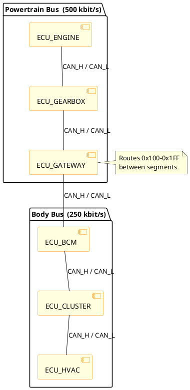

# 86. CAN Network Documentation


1. **Topology Documentation** — what to capture (physical segments, nodes, gateways, bit rates, physical layer) plus a diagram-as-code approach using PlantUML and a machine-readable TOML topology registry.

2. **Signal Lists / DBC Format** — full anatomy of a `.dbc` file with annotated field-by-field tables explaining start bit, byte order, factor/offset, and value tables.

3. **Node Descriptors (A2L)** — how ASAM A2L calibration files complement the DBC for ECU measurement and calibration toolchains.

4. **Configuration Management** — recommended repository layout, versioning and branching rules, multi-team sign-off process, and bus timing JSON configuration.

5. **C++ Topology Validator** — STL-only, no external dependencies; parses the TOML topology file and enforces six validation rules (termination count, index validity, duplicate HW IDs, bus references, gateway presence, bitrate warnings).

6. **C++ DBC Parser & Decoder** — regex-based parser producing a full in-memory signal catalogue; correct Intel/Motorola bit extraction and sign-extension for physical value decoding.

7. **Rust Topology Validator + DOT Renderer** — idiomatic Rust model, same six validation rules, plus automatic Graphviz DOT file generation for rendering SVG topology diagrams.

8. **Rust DBC Parser + Typed Signal Registry** — runtime parser plus a `define_signal!` macro that generates zero-sized structs implementing a `CanSignal` trait — signal errors caught at compile time with unit tests.

9. **CI Integration** — GitHub Actions pipeline YAML, and a Python ID-conflict checker for cross-DBC duplicate detection.

# 86. CAN Network Documentation

> Best practices for maintaining network topology diagrams, signal lists, and configuration management.

---

## Table of Contents

1. [Introduction](#introduction)
2. [CAN Network Topology Documentation](#1-can-network-topology-documentation)
3. [Signal Lists and the DBC File Format](#2-signal-lists-and-the-dbc-file-format)
4. [Node and ECU Descriptor Files (NCD / A2L)](#3-node-and-ecu-descriptor-files-ncd--a2l)
5. [Configuration Management Strategies](#4-configuration-management-strategies)
6. [Programmatic Topology Validation — C/C++](#5-programmatic-topology-validation--cc)
7. [DBC Signal Parsing — C/C++](#6-dbc-signal-parsing--cc)
8. [CAN Network Documentation Tools — Rust](#7-can-network-documentation-tools--rust)
9. [Signal Registry in Rust](#8-signal-registry-in-rust)
10. [Automated Consistency Checks](#9-automated-consistency-checks)
11. [Summary](#summary)

---

## Introduction

A Controller Area Network (CAN) bus connects dozens — sometimes hundreds — of Electronic Control Units (ECUs) inside a vehicle, industrial machine, or embedded system. Keeping that network *understandable and reproducible* over its full lifetime demands disciplined documentation. Three artefacts are at the heart of CAN network documentation:

| Artefact | Purpose | Typical Format |
|---|---|---|
| **Network Topology Diagram** | Visual map of nodes, buses, gateways, and termination | SVG / PDF / Visio / PlantUML |
| **Signal List / Message Catalogue** | Every message ID, signal, scaling, unit, and sender/receiver | DBC · ARXML · CSV |
| **Configuration Database** | Bus speed, sample-point, sync-jump-width, filter banks | JSON · TOML · XML |

Neglecting any one of these leads to integration failures, regression bugs, and painful reverse-engineering sessions months or years after the original developer has moved on.

---

## 1. CAN Network Topology Documentation

### 1.1 What a Topology Document Must Capture

A complete topology document records:

- **Physical bus segments** — which ECUs share a bus, cable topology (linear, star), and where terminators (120 Ω) are placed.
- **Network nodes** — node names, hardware identifiers, software versions, and responsible team.
- **Gateway / bridge ECUs** — which segments they bridge and which messages they route or translate.
- **Bit-rate per segment** — Classical CAN 125 kbit/s … 1 Mbit/s; CAN FD 2–8 Mbit/s data phase.
- **Physical layer** — ISO 11898-2 high-speed, ISO 11898-3 fault-tolerant, or single-wire GM LAN.

### 1.2 Topology Diagram as Code (PlantUML)

Storing diagrams as text files makes them diff-able and merge-friendly:



Store this `.puml` file alongside your firmware sources and regenerate the PNG/SVG in CI.

### 1.3 Topology Metadata File (TOML)

```toml
# network_topology.toml  — machine-readable topology registry

[network]
name        = "Vehicle CAN Network Rev3"
created     = "2024-01-15"
revised     = "2025-11-02"
author      = "E/E Architecture Team"

[[bus]]
id          = "PT_CAN"
bitrate_kbs = 500
protocol    = "CAN 2.0B"
termination = [1, 24]        # node indices that carry 120-ohm termination

[[bus]]
id          = "BODY_CAN"
bitrate_kbs = 250
protocol    = "CAN 2.0B"
termination = [3, 8]

[[node]]
index       = 1
name        = "ECU_ENGINE"
bus         = "PT_CAN"
hw_id       = "HW-ENG-0042"
sw_version  = "3.4.1"
vendor      = "BoschDiv"
tx_ids      = ["0x100", "0x101", "0x102"]
rx_ids      = ["0x200", "0x201"]

[[node]]
index       = 3
name        = "ECU_GATEWAY"
bus         = ["PT_CAN", "BODY_CAN"]
hw_id       = "HW-GW-0011"
sw_version  = "2.1.0"
routes      = [{from="PT_CAN", to="BODY_CAN", ids=["0x100","0x101"]}]
```

---

## 2. Signal Lists and the DBC File Format

### 2.1 DBC File Anatomy

The `.dbc` (Database CAN) format is the industry-standard signal catalogue. Every CAN frame and every signal it carries is described in one text file:

```
VERSION ""

NS_ :  ; New Symbols — leave empty or list symbolic names

BS_:   ; Bit timing — legacy, usually empty

BU_: ECU_ENGINE ECU_GEARBOX ECU_GATEWAY ECU_BCM ECU_CLUSTER

BO_ 256 EngineStatus: 8 ECU_ENGINE
 SG_ EngineSpeed      : 0|16@1+ (0.25,0)   [0|16383.75] "rpm"  ECU_CLUSTER,ECU_GATEWAY
 SG_ CoolantTemp      : 16|8@1+ (0.75,-40) [-40|148.75] "degC" ECU_CLUSTER
 SG_ ThrottlePosition : 24|8@1+ (0.4,0)    [0|100]      "%"    ECU_GEARBOX
 SG_ EngineRunning    : 32|1@1+ (1,0)      [0|1]        ""     Vector__XXX

BO_ 512 GearboxStatus: 4 ECU_GEARBOX
 SG_ CurrentGear   : 0|4@1+  (1,0) [0|15]   ""    ECU_ENGINE,ECU_CLUSTER
 SG_ GearshiftActive: 4|1@1+ (1,0) [0|1]    ""    ECU_ENGINE

CM_ SG_ 256 EngineSpeed "Engine rotational speed, raw value × 0.25 = RPM";
CM_ SG_ 256 CoolantTemp "Engine coolant temperature. (raw × 0.75) − 40 = °C";

BA_DEF_ SG_ "SystemSignalLongSymbol" STRING;
BA_DEF_DEF_ "SystemSignalLongSymbol" "";

VAL_ 512 CurrentGear
  0 "Park" 1 "Reverse" 2 "Neutral" 3 "Drive"
  4 "Sport" 15 "Invalid";
```

### 2.2 Signal Encoding Fields

| Field | Meaning | Example |
|---|---|---|
| `start_bit` | LSB position in the 64-bit frame | `0` |
| `length` | Bit count | `16` |
| `byte_order` | `@1` = Intel (little-endian), `@0` = Motorola (big-endian) | `@1+` |
| `value_type` | `+` unsigned, `-` signed | `+` |
| `factor` | Physical = raw × factor + offset | `0.25` |
| `offset` | | `0` |
| `min / max` | Physical range | `[0\|16383.75]` |
| `unit` | Engineering unit | `"rpm"` |
| `receivers` | Comma-separated node names | `ECU_CLUSTER` |

---

## 3. Node and ECU Descriptor Files (NCD / A2L)

ASAM A2L files complement the DBC by adding calibration parameters, measurement variables, and memory addresses — essential for ECU flashing and calibration toolchains (CANape, INCA). Key sections:

```
/begin PROJECT Engine_Cal ""
  /begin MODULE ENGINE_ECU ""

    /begin MEASUREMENT EngineSpeed_Meas
      "Live engine speed measurement"
      UWORD   /* data type */
      Conversion_RPM
      1  /* resolution */
      0.01 /* accuracy */
      0  16383.75
      ECU_ADDRESS 0x4002_A000
    /end MEASUREMENT

    /begin COMPU_METHOD Conversion_RPM
      "Counts to RPM"
      TAB_VERB
      "%6.2" "rpm"
      /begin COMPU_TAB
        1
        0 0.0
        65535 16383.75
      /end COMPU_TAB
    /end COMPU_METHOD

  /end MODULE
/end PROJECT
```

Keeping A2L files under version control alongside the DBC ensures calibration engineers are always working against a consistent signal definition.

---

## 4. Configuration Management Strategies

### 4.1 Repository Layout

```
can_network/
├── topology/
│   ├── network_topology.toml       ← machine-readable node/bus registry
│   ├── network_topology.puml       ← PlantUML diagram source
│   └── network_topology.svg        ← generated (CI artefact, do not edit)
├── databases/
│   ├── powertrain.dbc              ← PT CAN signal catalogue
│   ├── body.dbc                    ← Body CAN signal catalogue
│   └── diagnostics.dbc             ← UDS / OBD-II diagnostic frames
├── calibration/
│   └── engine.a2l
├── config/
│   ├── pt_can.json                 ← bus timing + filter config
│   └── body_can.json
├── scripts/
│   ├── validate_topology.py        ← CI consistency checker
│   └── generate_header.py          ← auto-generates C signal macros from DBC
└── CHANGELOG.md
```

### 4.2 Versioning Rules

- **Tag every release** — use semantic versions (`v2.3.0`) tied to ECU software releases.
- **Branching** — maintain a `main` branch for released networks; use feature branches for new signals; merge only after peer review and automated validation.
- **Change log** — for each merged change record: frame ID, signal name, direction (add / modify / remove), affected ECUs, and justification.
- **Sign-off** — require approval from: (a) the sender-ECU team, (b) every receiver-ECU team, and (c) the E/E architect.

### 4.3 Bus Timing Configuration (JSON)

```json
{
  "bus_id": "PT_CAN",
  "protocol": "CAN_FD",
  "nominal": {
    "bitrate_bps": 500000,
    "sample_point_pct": 80.0,
    "sync_jump_width": 1,
    "tseg1": 13,
    "tseg2": 2,
    "brp": 2
  },
  "data": {
    "bitrate_bps": 2000000,
    "sample_point_pct": 75.0,
    "sync_jump_width": 1,
    "tseg1": 7,
    "tseg2": 2,
    "brp": 1
  },
  "filters": [
    { "id": "0x100", "mask": "0x7F0", "type": "pass" },
    { "id": "0x200", "mask": "0x7FF", "type": "pass" }
  ]
}
```

---

## 5. Programmatic Topology Validation — C/C++

The following C++ program reads `network_topology.toml` (using a minimal hand-rolled parser for portability) and validates structural invariants: termination presence, gateway consistency, and duplicate node IDs.

```cpp
// can_topology_validator.cpp
// Build: g++ -std=c++17 -Wall -o validator can_topology_validator.cpp
//
// Reads a simplified TOML-like topology file and performs:
//   1. Termination check  — each bus must have exactly 2 terminators
//   2. Gateway check      — gateway nodes must appear on >= 2 buses
//   3. Duplicate ID check — no two nodes may share the same hw_id

#include <algorithm>
#include <fstream>
#include <iostream>
#include <map>
#include <set>
#include <sstream>
#include <stdexcept>
#include <string>
#include <vector>

// ─── Data model ─────────────────────────────────────────────────────────────

struct BusConfig {
    std::string id;
    uint32_t    bitrate_kbs{0};
    std::string protocol;
    std::vector<int> termination_nodes; // node indices
};

struct NodeConfig {
    int         index{0};
    std::string name;
    std::vector<std::string> buses;     // bus IDs this node is on
    std::string hw_id;
    std::string sw_version;
    bool        is_gateway{false};      // true if on more than one bus
};

struct Network {
    std::string name;
    std::vector<BusConfig>  buses;
    std::vector<NodeConfig> nodes;
};

// ─── Minimal TOML array-of-tables parser ────────────────────────────────────

static std::string trim(const std::string& s) {
    size_t a = s.find_first_not_of(" \t\r\n\"");
    size_t b = s.find_last_not_of(" \t\r\n\"");
    return (a == std::string::npos) ? "" : s.substr(a, b - a + 1);
}

static std::vector<std::string> split_csv(const std::string& s) {
    std::vector<std::string> result;
    std::stringstream ss(s);
    std::string tok;
    while (std::getline(ss, tok, ','))
        result.push_back(trim(tok));
    return result;
}

Network parse_topology(const std::string& path) {
    Network net;
    std::ifstream f(path);
    if (!f) throw std::runtime_error("Cannot open: " + path);

    std::string section;          // "bus" | "node" | "network"
    BusConfig   cur_bus;
    NodeConfig  cur_node;
    bool in_bus{false}, in_node{false};

    auto flush = [&]() {
        if (in_bus) {
            net.buses.push_back(cur_bus);
            cur_bus = {};
            in_bus = false;
        }
        if (in_node) {
            cur_node.is_gateway = (cur_node.buses.size() > 1);
            net.nodes.push_back(cur_node);
            cur_node = {};
            in_node = false;
        }
    };

    std::string line;
    while (std::getline(f, line)) {
        // Strip comments
        if (auto pos = line.find('#'); pos != std::string::npos)
            line = line.substr(0, pos);
        line = trim(line);
        if (line.empty()) continue;

        if (line == "[[bus]]")  { flush(); in_bus  = true; continue; }
        if (line == "[[node]]") { flush(); in_node = true; continue; }
        if (line.rfind("[network]", 0) == 0) { flush(); section = "network"; continue; }

        auto eq = line.find('=');
        if (eq == std::string::npos) continue;
        std::string key = trim(line.substr(0, eq));
        std::string val = trim(line.substr(eq + 1));

        if (section == "network") {
            if (key == "name") net.name = val;
            continue;
        }
        if (in_bus) {
            if      (key == "id")          cur_bus.id          = val;
            else if (key == "bitrate_kbs") cur_bus.bitrate_kbs = std::stoul(val);
            else if (key == "protocol")    cur_bus.protocol    = val;
            else if (key == "termination") {
                // e.g.  termination = [1, 24]
                auto inner = val.substr(1, val.size() - 2); // strip [ ]
                for (auto& t : split_csv(inner))
                    cur_bus.termination_nodes.push_back(std::stoi(t));
            }
        }
        if (in_node) {
            if      (key == "index")      cur_node.index      = std::stoi(val);
            else if (key == "name")       cur_node.name       = val;
            else if (key == "hw_id")      cur_node.hw_id      = val;
            else if (key == "sw_version") cur_node.sw_version = val;
            else if (key == "bus") {
                // bus = "PT_CAN"  OR  bus = ["PT_CAN", "BODY_CAN"]
                if (val.front() == '[')
                    cur_node.buses = split_csv(val.substr(1, val.size()-2));
                else
                    cur_node.buses.push_back(val);
            }
        }
    }
    flush();
    return net;
}

// ─── Validation rules ────────────────────────────────────────────────────────

struct ValidationResult {
    bool        passed{true};
    std::vector<std::string> errors;
    std::vector<std::string> warnings;

    void error(const std::string& msg)   { errors.push_back(msg);   passed = false; }
    void warn(const std::string& msg)    { warnings.push_back(msg);               }
};

ValidationResult validate(const Network& net) {
    ValidationResult r;

    // Rule 1 — Each bus needs exactly 2 termination points
    for (const auto& bus : net.buses) {
        if (bus.termination_nodes.size() != 2)
            r.error("Bus '" + bus.id + "' has " +
                    std::to_string(bus.termination_nodes.size()) +
                    " terminator(s); expected exactly 2.");
    }

    // Rule 2 — Termination node indices must exist in the node list
    std::set<int> all_indices;
    for (const auto& n : net.nodes) all_indices.insert(n.index);

    for (const auto& bus : net.buses)
        for (int idx : bus.termination_nodes)
            if (!all_indices.count(idx))
                r.error("Bus '" + bus.id + "' references terminator node index " +
                        std::to_string(idx) + " which does not exist.");

    // Rule 3 — No duplicate hw_id
    std::map<std::string,std::string> hw_seen; // hw_id -> first node name
    for (const auto& node : net.nodes) {
        if (!node.hw_id.empty()) {
            auto [it, inserted] = hw_seen.emplace(node.hw_id, node.name);
            if (!inserted)
                r.error("Duplicate hw_id '" + node.hw_id + "' on nodes '" +
                        it->second + "' and '" + node.name + "'.");
        }
    }

    // Rule 4 — Gateway nodes must reference existing bus IDs
    std::set<std::string> bus_ids;
    for (const auto& b : net.buses) bus_ids.insert(b.id);

    for (const auto& node : net.nodes)
        for (const auto& bid : node.buses)
            if (!bus_ids.count(bid))
                r.error("Node '" + node.name + "' references unknown bus '" + bid + "'.");

    // Rule 5 — Warn if no gateway is defined
    bool has_gateway = std::any_of(net.nodes.begin(), net.nodes.end(),
                                   [](const NodeConfig& n){ return n.is_gateway; });
    if (!has_gateway && net.buses.size() > 1)
        r.warn("Multiple buses defined but no gateway node found.");

    // Rule 6 — Warn about unusually low bitrates
    for (const auto& bus : net.buses)
        if (bus.bitrate_kbs < 125)
            r.warn("Bus '" + bus.id + "' bitrate " +
                   std::to_string(bus.bitrate_kbs) + " kbit/s is below 125 kbit/s.");

    return r;
}

// ─── Entry point ─────────────────────────────────────────────────────────────

int main(int argc, char** argv) {
    const char* path = (argc > 1) ? argv[1] : "network_topology.toml";

    Network net;
    try {
        net = parse_topology(path);
    } catch (const std::exception& ex) {
        std::cerr << "[FATAL] " << ex.what() << '\n';
        return 2;
    }

    std::cout << "Network : " << net.name    << '\n'
              << "Buses   : " << net.buses.size()  << '\n'
              << "Nodes   : " << net.nodes.size()  << "\n\n";

    auto result = validate(net);

    for (const auto& w : result.warnings)
        std::cout << "[WARN]  " << w << '\n';
    for (const auto& e : result.errors)
        std::cout << "[ERROR] " << e << '\n';

    if (result.passed)
        std::cout << "\n✓  Topology validation passed.\n";
    else
        std::cout << "\n✗  Topology validation FAILED ("
                  << result.errors.size() << " error(s)).\n";

    return result.passed ? 0 : 1;
}
```

---

## 6. DBC Signal Parsing — C/C++

This C++ module parses a `.dbc` file into an in-memory signal catalogue and provides a `decode()` function that extracts physical values from raw CAN frames.

```cpp
// dbc_parser.hpp
#pragma once
#include <cstdint>
#include <map>
#include <string>
#include <vector>

struct DbcSignal {
    std::string name;
    uint32_t    start_bit{0};
    uint32_t    length{0};
    bool        is_little_endian{true};  // Intel byte order
    bool        is_signed{false};
    double      factor{1.0};
    double      offset{0.0};
    double      min_val{0.0};
    double      max_val{0.0};
    std::string unit;
    std::vector<std::string> receivers;
};

struct DbcMessage {
    uint32_t    id{0};
    std::string name;
    uint8_t     dlc{0};
    std::string sender;
    std::vector<DbcSignal> signals;
};

class DbcParser {
public:
    /// Parse a .dbc file; throws std::runtime_error on failure.
    void load(const std::string& path);

    /// Find a message by CAN ID (without RTR/EFF flags).
    const DbcMessage* find_message(uint32_t can_id) const;

    /// Decode all signals in a frame; returns map signal_name → physical_value.
    std::map<std::string,double> decode(uint32_t can_id,
                                        const uint8_t* data,
                                        uint8_t dlc) const;

    const std::vector<DbcMessage>& messages() const { return messages_; }

private:
    std::vector<DbcMessage> messages_;

    static uint64_t extract_raw(const uint8_t* data,
                                 uint8_t dlc,
                                 uint32_t start_bit,
                                 uint32_t length,
                                 bool little_endian);
};

// ─────────────────────────────────────────────────────────────────────────────

// dbc_parser.cpp
#include "dbc_parser.hpp"
#include <fstream>
#include <sstream>
#include <stdexcept>
#include <regex>
#include <iostream>

// BO_ 256 EngineStatus: 8 ECU_ENGINE
static const std::regex RE_MSG(
    R"(BO_\s+(\d+)\s+(\w+)\s*:\s*(\d+)\s+(\w+))");

// SG_ Speed : 0|16@1+ (0.25,0) [0|16383] "rpm" Node1,Node2
static const std::regex RE_SIG(
    R"(\s+SG_\s+(\w+)\s+:\s+(\d+)\|(\d+)@([01])([+-])\s+\(([\d.+-]+),([\d.+-]+)\)\s+\[([\d.+-]+)\|([\d.+-]+)\]\s+"([^"]*)"\s+([\w,]+))");

void DbcParser::load(const std::string& path) {
    std::ifstream f(path);
    if (!f) throw std::runtime_error("Cannot open DBC: " + path);

    DbcMessage* cur_msg = nullptr;
    std::string line;

    while (std::getline(f, line)) {
        std::smatch m;
        if (std::regex_search(line, m, RE_MSG)) {
            messages_.push_back({});
            cur_msg = &messages_.back();
            cur_msg->id     = static_cast<uint32_t>(std::stoul(m[1]));
            cur_msg->name   = m[2];
            cur_msg->dlc    = static_cast<uint8_t>(std::stoul(m[3]));
            cur_msg->sender = m[4];
        } else if (cur_msg && std::regex_search(line, m, RE_SIG)) {
            DbcSignal sig;
            sig.name            = m[1];
            sig.start_bit       = std::stoul(m[2]);
            sig.length          = std::stoul(m[3]);
            sig.is_little_endian= (m[4] == "1");
            sig.is_signed       = (m[5] == "-");
            sig.factor          = std::stod(m[6]);
            sig.offset          = std::stod(m[7]);
            sig.min_val         = std::stod(m[8]);
            sig.max_val         = std::stod(m[9]);
            sig.unit            = m[10];
            // Receivers
            std::istringstream ss(std::string(m[11]));
            std::string tok;
            while (std::getline(ss, tok, ',')) sig.receivers.push_back(tok);
            cur_msg->signals.push_back(std::move(sig));
        } else if (!line.empty() && line[0] != ' ' && line[0] != '\t') {
            cur_msg = nullptr; // left the current message block
        }
    }
}

const DbcMessage* DbcParser::find_message(uint32_t can_id) const {
    for (const auto& msg : messages_)
        if (msg.id == can_id) return &msg;
    return nullptr;
}

uint64_t DbcParser::extract_raw(const uint8_t* data, uint8_t /*dlc*/,
                                  uint32_t start_bit, uint32_t length,
                                  bool little_endian) {
    uint64_t raw = 0;
    if (little_endian) {
        // Intel (LSB first)
        for (uint32_t i = 0; i < length; ++i) {
            uint32_t bit = start_bit + i;
            if ((data[bit / 8] >> (bit % 8)) & 1u)
                raw |= (uint64_t(1) << i);
        }
    } else {
        // Motorola (MSB first) — start_bit is the MSB position
        uint32_t msb = start_bit;
        for (uint32_t i = 0; i < length; ++i) {
            uint32_t byte_pos = msb / 8;
            uint32_t bit_pos  = 7 - (msb % 8);
            if ((data[byte_pos] >> bit_pos) & 1u)
                raw |= (uint64_t(1) << (length - 1 - i));
            // advance to next MSB position in Motorola order
            if ((msb % 8) == 0)
                msb += 15;
            else
                --msb;
        }
    }
    return raw;
}

std::map<std::string,double>
DbcParser::decode(uint32_t can_id, const uint8_t* data, uint8_t dlc) const {
    std::map<std::string,double> result;
    const DbcMessage* msg = find_message(can_id);
    if (!msg) return result;

    for (const auto& sig : msg->signals) {
        uint64_t raw = extract_raw(data, dlc,
                                    sig.start_bit, sig.length,
                                    sig.is_little_endian);
        double phys;
        if (sig.is_signed) {
            // Sign-extend
            if (raw & (uint64_t(1) << (sig.length - 1)))
                raw |= ~((uint64_t(1) << sig.length) - 1);
            phys = static_cast<double>(static_cast<int64_t>(raw));
        } else {
            phys = static_cast<double>(raw);
        }
        phys = phys * sig.factor + sig.offset;
        result[sig.name] = phys;
    }
    return result;
}

// ─────────────────────────────────────────────────────────────────────────────
// Usage example (main.cpp):

int main() {
    DbcParser dbc;
    dbc.load("powertrain.dbc");

    // Simulate a received CAN frame: ID=0x100, DLC=8
    uint8_t frame[8] = { 0xE8, 0x03,   // EngineSpeed raw = 1000 → 250 rpm
                          0x81,         // CoolantTemp raw = 129 → 56.75 °C
                          0x64,         // ThrottlePosition raw = 100 → 40 %
                          0x01,         // EngineRunning = 1
                          0x00, 0x00, 0x00 };

    auto signals = dbc.decode(0x100, frame, 8);
    for (const auto& [name, value] : signals)
        std::cout << name << " = " << value << '\n';

    return 0;
}
```

---

## 7. CAN Network Documentation Tools — Rust

The Rust crate below parses a topology TOML file, validates it, and renders a DOT (Graphviz) topology graph — all without external crate dependencies for the core logic.

```rust
// src/topology.rs
//! CAN network topology model and TOML parser.

use std::collections::{HashMap, HashSet};
use std::fmt;
use std::fs;
use std::path::Path;

// ─── Data model ──────────────────────────────────────────────────────────────

#[derive(Debug, Clone)]
pub struct BusConfig {
    pub id:              String,
    pub bitrate_kbs:     u32,
    pub protocol:        String,
    pub terminations:    Vec<usize>, // node indices
}

#[derive(Debug, Clone)]
pub struct NodeConfig {
    pub index:      usize,
    pub name:       String,
    pub buses:      Vec<String>,
    pub hw_id:      String,
    pub sw_version: String,
}

impl NodeConfig {
    pub fn is_gateway(&self) -> bool { self.buses.len() > 1 }
}

#[derive(Debug)]
pub struct Network {
    pub name:  String,
    pub buses: Vec<BusConfig>,
    pub nodes: Vec<NodeConfig>,
}

// ─── Validation ───────────────────────────────────────────────────────────────

#[derive(Debug, Default)]
pub struct ValidationReport {
    pub errors:   Vec<String>,
    pub warnings: Vec<String>,
}

impl ValidationReport {
    pub fn passed(&self) -> bool { self.errors.is_empty() }
}

impl fmt::Display for ValidationReport {
    fn fmt(&self, f: &mut fmt::Formatter<'_>) -> fmt::Result {
        for w in &self.warnings { writeln!(f, "[WARN]  {w}")?; }
        for e in &self.errors   { writeln!(f, "[ERROR] {e}")?; }
        if self.passed() {
            writeln!(f, "\n✓  Topology validation passed.")
        } else {
            writeln!(f, "\n✗  Topology validation FAILED ({} error(s)).", self.errors.len())
        }
    }
}

pub fn validate(net: &Network) -> ValidationReport {
    let mut rep = ValidationReport::default();

    let node_indices: HashSet<usize> = net.nodes.iter().map(|n| n.index).collect();
    let bus_ids:      HashSet<&str>  = net.buses.iter().map(|b| b.id.as_str()).collect();

    // Rule 1 — each bus must have exactly 2 terminators
    for bus in &net.buses {
        match bus.terminations.len() {
            2 => {},
            n => rep.errors.push(format!(
                "Bus '{}' has {} terminator(s); expected 2.", bus.id, n
            )),
        }
        // Rule 2 — terminator indices must be valid
        for &idx in &bus.terminations {
            if !node_indices.contains(&idx) {
                rep.errors.push(format!(
                    "Bus '{}' terminator index {} does not exist.", bus.id, idx
                ));
            }
        }
        // Rule 6 — low bitrate warning
        if bus.bitrate_kbs < 125 {
            rep.warnings.push(format!(
                "Bus '{}' bitrate {} kbit/s is below 125 kbit/s.", bus.id, bus.bitrate_kbs
            ));
        }
    }

    // Rule 3 — no duplicate hw_id
    let mut hw_seen: HashMap<&str, &str> = HashMap::new();
    for node in &net.nodes {
        if !node.hw_id.is_empty() {
            if let Some(prev) = hw_seen.insert(&node.hw_id, &node.name) {
                rep.errors.push(format!(
                    "Duplicate hw_id '{}' on nodes '{}' and '{}'.",
                    node.hw_id, prev, node.name
                ));
            }
        }
    }

    // Rule 4 — bus references must be valid
    for node in &net.nodes {
        for bid in &node.buses {
            if !bus_ids.contains(bid.as_str()) {
                rep.errors.push(format!(
                    "Node '{}' references unknown bus '{}'.", node.name, bid
                ));
            }
        }
    }

    // Rule 5 — warn if multiple buses but no gateway
    if net.buses.len() > 1 && !net.nodes.iter().any(|n| n.is_gateway()) {
        rep.warnings.push(
            "Multiple buses defined but no gateway node found.".to_string()
        );
    }

    rep
}

// ─── DOT graph generator ─────────────────────────────────────────────────────

pub fn render_dot(net: &Network) -> String {
    let mut out = String::from("digraph CAN_Network {\n");
    out.push_str("    rankdir=LR;\n");
    out.push_str("    node [shape=box, style=filled];\n\n");

    // Bus subgraphs
    for bus in &net.buses {
        out.push_str(&format!("    subgraph cluster_{} {{\n", bus.id));
        out.push_str(&format!("        label=\"{} ({} kbit/s)\";\n",
                              bus.id, bus.bitrate_kbs));
        out.push_str("        style=dashed;\n");

        for node in &net.nodes {
            if node.buses.contains(&bus.id) {
                let colour = if node.is_gateway() { "lightblue" } else { "lightyellow" };
                out.push_str(&format!(
                    "        {} [label=\"{}\\n{}\" fillcolor={}];\n",
                    node.name.replace('-', "_"),
                    node.name, node.sw_version, colour
                ));
            }
        }
        out.push_str("    }\n\n");
    }

    // Gateway edges
    for node in net.nodes.iter().filter(|n| n.is_gateway()) {
        for (i, from_bus) in node.buses.iter().enumerate() {
            for to_bus in node.buses.iter().skip(i + 1) {
                out.push_str(&format!(
                    "    {} -> {} [label=\"routes via {}\" style=dashed];\n",
                    from_bus, to_bus, node.name
                ));
            }
        }
    }

    out.push_str("}\n");
    out
}
```

```rust
// src/dbc.rs
//! DBC signal catalogue parser and decoder.

use std::collections::HashMap;
use std::fs;

#[derive(Debug, Clone)]
pub struct Signal {
    pub name:             String,
    pub start_bit:        u32,
    pub length:           u32,
    pub little_endian:    bool,
    pub signed:           bool,
    pub factor:           f64,
    pub offset:           f64,
    pub min:              f64,
    pub max:              f64,
    pub unit:             String,
    pub receivers:        Vec<String>,
}

#[derive(Debug)]
pub struct Message {
    pub id:      u32,
    pub name:    String,
    pub dlc:     u8,
    pub sender:  String,
    pub signals: Vec<Signal>,
}

#[derive(Debug, Default)]
pub struct DbcCatalogue {
    messages: HashMap<u32, Message>,
}

impl DbcCatalogue {
    /// Load a .dbc file into the catalogue.
    pub fn load(path: &str) -> Result<Self, String> {
        let content = fs::read_to_string(path)
            .map_err(|e| format!("Cannot open {path}: {e}"))?;
        Self::parse(&content)
    }

    pub fn parse(content: &str) -> Result<Self, String> {
        let mut cat = DbcCatalogue::default();
        let mut cur: Option<Message> = None;

        for line in content.lines() {
            let line = line.trim();

            if line.starts_with("BO_ ") {
                // Flush previous message
                if let Some(msg) = cur.take() {
                    cat.messages.insert(msg.id, msg);
                }
                // BO_ <id> <name>: <dlc> <sender>
                let parts: Vec<&str> = line.splitn(5, ' ').collect();
                if parts.len() < 5 { continue; }
                let id    = parts[1].parse::<u32>().unwrap_or(0);
                let name  = parts[2].trim_end_matches(':').to_string();
                let dlc   = parts[3].parse::<u8>().unwrap_or(0);
                let sender = parts[4].to_string();
                cur = Some(Message { id, name, dlc, sender, signals: Vec::new() });

            } else if line.starts_with("SG_ ") {
                // SG_ <name> : <start>|<len>@<bo><sign> (<f>,<o>) [<min>|<max>] "<unit>" <rcvrs>
                if let Some(ref mut msg) = cur {
                    if let Some(sig) = parse_signal_line(line) {
                        msg.signals.push(sig);
                    }
                }
            } else if !line.is_empty()
                       && !line.starts_with(' ')
                       && !line.starts_with('\t') {
                // Any non-indented token ends the current BO_ block
                if let Some(msg) = cur.take() {
                    cat.messages.insert(msg.id, msg);
                }
            }
        }
        if let Some(msg) = cur {
            cat.messages.insert(msg.id, msg);
        }
        Ok(cat)
    }

    pub fn find(&self, id: u32) -> Option<&Message> {
        self.messages.get(&id)
    }

    /// Decode all signals for a received frame.
    /// Returns a map of signal_name → physical_value.
    pub fn decode(&self, id: u32, data: &[u8]) -> HashMap<String, f64> {
        let mut result = HashMap::new();
        if let Some(msg) = self.find(id) {
            for sig in &msg.signals {
                let raw = extract_raw(data, sig.start_bit, sig.length, sig.little_endian);
                let phys = if sig.signed {
                    let signed = sign_extend(raw, sig.length) as f64;
                    signed * sig.factor + sig.offset
                } else {
                    raw as f64 * sig.factor + sig.offset
                };
                result.insert(sig.name.clone(), phys);
            }
        }
        result
    }
}

// ─── Helpers ─────────────────────────────────────────────────────────────────

fn parse_signal_line(line: &str) -> Option<Signal> {
    // Very minimal parser for the most common DBC signal syntax.
    // A production parser should use a proper grammar (e.g., pest or nom).
    let after_sg = line.strip_prefix("SG_ ")?;
    let colon = after_sg.find(" : ")?;
    let name = after_sg[..colon].trim().to_string();
    let rest = after_sg[colon + 3..].trim();

    // "<start>|<len>@<bo><sign>"
    let pipe   = rest.find('|')?;
    let at_pos = rest.find('@')?;
    let start_bit: u32 = rest[..pipe].parse().ok()?;
    let length:    u32 = rest[pipe+1..at_pos].parse().ok()?;
    let bo_sign = &rest[at_pos+1..];
    let little_endian = bo_sign.starts_with('1');
    let signed = bo_sign.contains('-');

    // "(<factor>,<offset>) [<min>|<max>] "<unit>" <rcvrs>"
    let lp = rest.find('(')?;
    let rp = rest.find(')')?;
    let fo_str = &rest[lp+1..rp];
    let comma = fo_str.find(',')?;
    let factor: f64 = fo_str[..comma].parse().ok()?;
    let offset: f64 = fo_str[comma+1..].parse().ok()?;

    let lb = rest.find('[')?;
    let rb = rest.find(']')?;
    let range_str = &rest[lb+1..rb];
    let rbar = range_str.find('|')?;
    let min: f64 = range_str[..rbar].parse().ok()?;
    let max: f64 = range_str[rbar+1..].parse().ok()?;

    let q1 = rest.find('"')?;
    let q2 = rest[q1+1..].find('"')? + q1 + 1;
    let unit = rest[q1+1..q2].to_string();

    let receivers_str = rest[q2+1..].trim();
    let receivers: Vec<String> = receivers_str
        .split(',')
        .map(|s| s.trim().to_string())
        .filter(|s| !s.is_empty())
        .collect();

    Some(Signal { name, start_bit, length, little_endian, signed,
                  factor, offset, min, max, unit, receivers })
}

fn extract_raw(data: &[u8], start_bit: u32, length: u32, little_endian: bool) -> u64 {
    let mut raw: u64 = 0;
    if little_endian {
        for i in 0..length {
            let bit = (start_bit + i) as usize;
            if bit / 8 < data.len() && (data[bit / 8] >> (bit % 8)) & 1 == 1 {
                raw |= 1u64 << i;
            }
        }
    } else {
        let mut msb = start_bit as usize;
        for i in 0..length as usize {
            let byte_pos = msb / 8;
            let bit_pos  = 7 - (msb % 8);
            if byte_pos < data.len() && (data[byte_pos] >> bit_pos) & 1 == 1 {
                raw |= 1u64 << (length as usize - 1 - i);
            }
            if msb % 8 == 0 { msb += 15; } else { msb -= 1; }
        }
    }
    raw
}

fn sign_extend(value: u64, bits: u32) -> i64 {
    let shift = 64 - bits;
    ((value << shift) as i64) >> shift
}
```

```rust
// src/main.rs
mod topology;
mod dbc;

use topology::{parse_topology_toml, validate, render_dot};
use dbc::DbcCatalogue;

fn main() {
    // ── 1. Validate topology ──────────────────────────────────────────────
    let net = parse_topology_toml("network_topology.toml")
        .expect("Failed to parse topology");

    println!("Network : {}", net.name);
    println!("Buses   : {}", net.buses.len());
    println!("Nodes   : {}", net.nodes.len());
    println!();

    let report = validate(&net);
    print!("{report}");

    // ── 2. Render DOT diagram ─────────────────────────────────────────────
    let dot = render_dot(&net);
    std::fs::write("network_topology.dot", &dot)
        .expect("Cannot write DOT file");
    println!("DOT diagram written to network_topology.dot");
    println!("Run: dot -Tsvg network_topology.dot -o network_topology.svg");

    // ── 3. Decode a sample CAN frame ──────────────────────────────────────
    let dbc = DbcCatalogue::load("powertrain.dbc")
        .expect("Failed to load DBC");

    // Simulated frame: 0x100 (EngineStatus), DLC=8
    let frame: [u8; 8] = [0xE8, 0x03, 0x81, 0x64, 0x01, 0x00, 0x00, 0x00];
    let decoded = dbc.decode(0x100, &frame);

    println!("\nDecoded signals for frame 0x100:");
    let mut pairs: Vec<_> = decoded.iter().collect();
    pairs.sort_by_key(|(k, _)| k.as_str());
    for (name, value) in pairs {
        println!("  {name:25} = {value}");
    }
}
```

---

## 8. Signal Registry in Rust

A compile-time checked signal registry prevents typos in signal names and catches version mismatches at build time:

```rust
// src/signal_registry.rs
//! A typed, compile-time-checked signal registry built from a macro.
//! Each signal is a zero-sized struct implementing the `CanSignal` trait,
//! so the compiler verifies names and parameter ranges.

pub trait CanSignal {
    const NAME:       &'static str;
    const MSG_ID:     u32;
    const START_BIT:  u32;
    const LENGTH:     u32;
    const FACTOR:     f64;
    const OFFSET:     f64;
    const UNIT:       &'static str;

    fn decode(raw: u64) -> f64 {
        raw as f64 * Self::FACTOR + Self::OFFSET
    }
}

macro_rules! define_signal {
    (
        $struct_name:ident,
        name       = $name:literal,
        msg_id     = $msg_id:expr,
        start_bit  = $start_bit:expr,
        length     = $length:expr,
        factor     = $factor:expr,
        offset     = $offset:expr,
        unit       = $unit:literal
    ) => {
        pub struct $struct_name;
        impl CanSignal for $struct_name {
            const NAME:      &'static str = $name;
            const MSG_ID:    u32          = $msg_id;
            const START_BIT: u32          = $start_bit;
            const LENGTH:    u32          = $length;
            const FACTOR:    f64          = $factor;
            const OFFSET:    f64          = $offset;
            const UNIT:      &'static str = $unit;
        }
    };
}

// Generated from DBC (could be produced by a build.rs script):
define_signal!(
    EngineSpeed,
    name       = "EngineSpeed",
    msg_id     = 0x100,
    start_bit  = 0,
    length     = 16,
    factor     = 0.25,
    offset     = 0.0,
    unit       = "rpm"
);

define_signal!(
    CoolantTemp,
    name       = "CoolantTemp",
    msg_id     = 0x100,
    start_bit  = 16,
    length     = 8,
    factor     = 0.75,
    offset     = -40.0,
    unit       = "degC"
);

define_signal!(
    ThrottlePosition,
    name       = "ThrottlePosition",
    msg_id     = 0x100,
    start_bit  = 24,
    length     = 8,
    factor     = 0.4,
    offset     = 0.0,
    unit       = "%"
);

// ─── Usage ───────────────────────────────────────────────────────────────────
#[cfg(test)]
mod tests {
    use super::*;

    #[test]
    fn decode_engine_speed() {
        // Raw value 1000 → 1000 × 0.25 + 0.0 = 250 rpm
        let raw: u64 = 1000;
        let rpm = EngineSpeed::decode(raw);
        assert!((rpm - 250.0).abs() < f64::EPSILON,
                "Expected 250.0 rpm, got {rpm}");
    }

    #[test]
    fn decode_coolant_temp() {
        // Raw 129 → 129 × 0.75 − 40 = 56.75 °C
        let raw: u64 = 129;
        let temp = CoolantTemp::decode(raw);
        assert!((temp - 56.75).abs() < 1e-9,
                "Expected 56.75 °C, got {temp}");
    }

    #[test]
    fn signal_meta() {
        assert_eq!(EngineSpeed::MSG_ID,    0x100);
        assert_eq!(EngineSpeed::START_BIT, 0);
        assert_eq!(EngineSpeed::LENGTH,    16);
        assert_eq!(EngineSpeed::UNIT,      "rpm");
    }
}
```

---

## 9. Automated Consistency Checks

### 9.1 CI Pipeline Integration (GitHub Actions)

```yaml
# .github/workflows/can_docs.yml
name: CAN Network Documentation CI

on:
  push:
    paths:
      - 'can_network/**'

jobs:
  validate:
    runs-on: ubuntu-latest
    steps:
      - uses: actions/checkout@v4

      - name: Validate topology
        run: |
          cd can_network
          cargo run --bin validator -- topology/network_topology.toml

      - name: Validate DBC files
        run: |
          pip install cantools
          python scripts/validate_dbc.py databases/powertrain.dbc
          python scripts/validate_dbc.py databases/body.dbc

      - name: Check ID uniqueness across DBCs
        run: python scripts/check_id_conflicts.py databases/

      - name: Generate C signal headers
        run: python scripts/generate_header.py databases/powertrain.dbc > src/powertrain_signals.h

      - name: Generate topology SVG
        run: |
          dot -Tsvg topology/network_topology.dot -o topology/network_topology.svg
        continue-on-error: true

      - name: Upload artefacts
        uses: actions/upload-artifact@v4
        with:
          name: can-docs
          path: |
            topology/network_topology.svg
            src/powertrain_signals.h
```

### 9.2 ID Conflict Checker (Python helper invoked from CI)

```python
# scripts/check_id_conflicts.py
"""Detect duplicate CAN message IDs across all DBC files in a directory."""
import glob, sys, re, collections, pathlib

def extract_ids(path):
    ids = {}
    for line in pathlib.Path(path).read_text().splitlines():
        m = re.match(r'BO_\s+(\d+)\s+(\w+)', line)
        if m:
            ids[int(m[1])] = m[2]
    return ids

directory = sys.argv[1] if len(sys.argv) > 1 else "databases"
all_ids: dict[int, list[tuple[str,str]]] = collections.defaultdict(list)

for dbc_file in glob.glob(f"{directory}/*.dbc"):
    for msg_id, name in extract_ids(dbc_file).items():
        all_ids[msg_id].append((dbc_file, name))

conflicts = {k: v for k, v in all_ids.items() if len(v) > 1}
if conflicts:
    print(f"ERROR: {len(conflicts)} duplicate CAN ID(s) found:")
    for cid, entries in sorted(conflicts.items()):
        print(f"  0x{cid:03X} ({cid:>4d}):")
        for fname, name in entries:
            print(f"    {fname}: {name}")
    sys.exit(1)
else:
    print(f"OK: No duplicate IDs found across {len(all_ids)} messages.")
```

---

## Summary

CAN network documentation is not a one-time deliverable — it is a living system that must evolve with the network itself. The key practices and tools covered in this document are:

**Topology Documentation** keeps the physical picture accurate. Storing topology as structured TOML (machine-readable) and PlantUML or DOT (human-readable diagram-as-code) makes it diff-able in version control and renderable in CI. A programmatic validator (demonstrated in C++ and Rust) enforces structural invariants — termination rules, node uniqueness, valid bus references — automatically on every commit.

**Signal Lists (DBC)** are the contractual interface between ECUs. Every signal has a canonical definition: bit position, byte order, scaling, unit, and ownership. Parser implementations in both C++ (regex-based, STL-only) and Rust (hand-written, zero-dependency) demonstrate how to decode physical values from raw frames at runtime. A compile-time Rust signal registry (`define_signal!` macro + `CanSignal` trait) pushes error detection even earlier — to build time.

**Configuration Management** combines semantic versioning of DBC/TOML files, structured change logs, mandatory multi-team review, and CI-driven consistency checks (ID conflict detection, header code generation, SVG topology rendering). Together these prevent the most common integration failures: stale signal definitions, duplicate message IDs, and undocumented topology changes.

The golden rule: **every change to a CAN frame or network node must be represented as a change to a text file in version control, validated automatically, and reviewed by all affected teams before merge.** This discipline keeps multi-ECU systems maintainable across their full operational lifetime.